# ML AdamW Demo

[](https://www.python.org/)
[](https://pytorch.org/)
[](https://arxiv.org/abs/1711.05101)
[](https://pytorch.org/docs/stable/optim.html)
[](https://pytorch.org/docs/stable/amp.html)
[](LICENSE)
[](https://github.com/hkevin01/ml-adamw-demo)
[](README.md)
[](tests/)
[](https://github.com/hkevin01/ml-adamw-demo/actions)
[](https://peps.python.org/pep-0008/)
[](CONTRIBUTING.md)

This repository is a production-style PyTorch training project built to demonstrate a complete supervised learning pipeline centered on the **AdamW** optimizer (an adaptive gradient-descent algorithm with decoupled L2 regularization) and configurable learning-rate schedulers (algorithms that change the step size during training). The project is intentionally designed to be small enough to read entirely in one sitting, yet structured closely enough to production code that lessons learned here transfer directly to larger systems. Every module, config field, and CLI flag exists for a specific reason, and this README documents all of them in depth.

The code separates data creation, model definition, training, evaluation, and utility concerns into distinct modules so each layer can be understood, tested, and replaced independently. If you are learning optimizer behavior, scheduler dynamics, reproducible experiment setup, or PyTorch best practices at the same time, this project gives you a working baseline rather than a toy snippet. The architecture is intentionally simple on the data and model side so that the optimizer and scheduler choices are the primary variable that drives differences in training curves, which is exactly the behavior you want when studying optimizer dynamics.

This project is also a template for how to write a maintainable deep learning training harness. The patterns used here - frozen dataclass configurations, a single composition root entry point, separated concerns across modules, explicit artifact persistence, and CLI-driven experiments - apply directly to projects with millions of parameters, terabytes of data, and multi-GPU training. The scale changes; the patterns do not.

> [!NOTE]
> All four scheduler modes (`none`, `cosine`, `onecycle`, `linear`) have been smoke-tested end-to-end. Each reaches `val_acc=1.0` on the synthetic dataset within two epochs, confirming the pipeline is correct and scheduler switching works for all supported modes. The full 35-test unit test suite passes on every commit via GitHub Actions CI.

> [!TIP]
> If you are new to deep learning, read the [Glossary of Key Terms](#glossary-of-key-terms) before any other section. It defines every technical term used throughout this README in plain English with project-specific context.

---

## Table of Contents

- [Glossary of Key Terms](#glossary-of-key-terms)
- [What Is AdamW?](#what-is-adamw)
- [How AdamW Works Internally](#how-adamw-works-internally)
- [Project Goals](#project-goals)
- [Reader Guide](#reader-guide)
- [Quickstart](#quickstart)
- [Project Structure](#project-structure)
- [System Architecture](#system-architecture)
- [Tech Stack Deep Dive](#tech-stack-deep-dive)
- [Dataset and Data Pipeline](#dataset-and-data-pipeline)
- [Model Architecture](#model-architecture)
- [Training Lifecycle](#training-lifecycle)
- [AMP and GPU Acceleration](#amp-and-gpu-acceleration)
- [Learning-Rate Schedulers](#learning-rate-schedulers)
- [Scheduler Mathematical Reference](#scheduler-mathematical-reference)
- [AdamW Hyperparameter Guide](#adamw-hyperparameter-guide)
- [Reproducibility and Experiment Design](#reproducibility-and-experiment-design)
- [CLI Reference](#cli-reference)
- [Outputs and Artifacts](#outputs-and-artifacts)
- [Collapsible API Reference](#collapsible-api-reference)
- [Extending the Project](#extending-the-project)
- [CI/CD Pipeline](#cicd-pipeline)
- [Operational Tips and Troubleshooting](#operational-tips-and-troubleshooting)
- [Frequently Asked Questions](#frequently-asked-questions)
- [Architecture Decisions](#architecture-decisions)
- [Implementation Checklist](#implementation-checklist)

---

## Glossary of Key Terms

This glossary defines every significant technical term used in this README and in the source code. Terms are listed alphabetically. You do not need to read this section top-to-bottom; use it as a reference while reading other sections. Each entry includes not just a definition but enough context to understand how the concept applies specifically to this project.

> [!TIP]
> If you encounter an unfamiliar term anywhere in this README, come back here first before searching externally. Most concepts are defined below with enough context to understand how they apply specifically to this project.

| # | Term | Plain-English Definition |
| --- | --- | --- |
| 1 | **Ablation** | A controlled experiment where one component is removed or disabled to measure its contribution. In this project, running with `--scheduler none` is an ablation of the scheduler. |
| 2 | **Adam** | Adaptive Moment Estimation. An optimizer that maintains a running average of past gradients (first moment) and past squared gradients (second moment) to scale each parameter's step size individually. |
| 3 | **AdamW** | Adam with decoupled Weight decay. Identical to Adam except that L2 regularization is applied directly to the weights after the gradient update rather than being folded into the gradient itself. This prevents the adaptive scaling from interfering with regularization. |
| 4 | **AMP** | Automatic Mixed Precision. A training technique that uses 16-bit floating point for most operations and 32-bit only where numerical precision is critical. Reduces memory usage and speeds up training on NVIDIA GPUs without significant accuracy loss. |
| 5 | **Argparse** | Python standard library module used to define and parse command-line arguments. Every `--flag` in this project is declared via argparse in `src/main.py`. |
| 6 | **Artifact** | A file produced by a training run - in this project, `history.json` and `curves.png`. Artifacts persist after the process exits and serve as the audit trail for an experiment. |
| 7 | **Autograd** | PyTorch's automatic differentiation engine. When you call `loss.backward()`, autograd traverses the computation graph and computes the gradient of the loss with respect to every parameter that has `requires_grad=True`. |
| 8 | **Backward pass** | The phase of training where gradients are computed by propagating the loss signal backwards through the network using the chain rule. Follows the forward pass. |
| 9 | **Batch / Mini-batch** | A fixed-size subset of the training dataset used for one gradient update step. Smaller batches introduce more gradient noise (which can act as regularization); larger batches give smoother but potentially sharper minima. |
| 10 | **Checkpoint** | A saved copy of model weights at a specific point during training. This project saves `best_model.pt` whenever validation loss improves, so you can reload the best weights after training completes. |
| 11 | **CI** | Continuous Integration. An automated system that runs tests and validation checks on every code change. This project uses GitHub Actions, defined in `.github/workflows/ci.yml`. |
| 12 | **CLI** | Command-Line Interface. The set of `--flags` and arguments accepted by `python src/main.py`. Every experiment in this project is controlled entirely through the CLI. |
| 13 | **CosineAnnealingLR** | A PyTorch learning-rate scheduler that decays the LR following the shape of a cosine curve from the initial value toward `eta_min` over `T_max` epochs. The decay is slow at first, fast in the middle, and slow again near the end. |
| 14 | **CrossEntropyLoss** | The standard loss function for multi-class classification. It measures how far the model's predicted probability distribution is from the true class label. Internally combines a log-softmax with a negative log-likelihood computation. |
| 15 | **CUDA** | Compute Unified Device Architecture. NVIDIA's parallel computing platform that enables GPU acceleration. PyTorch uses CUDA to run tensor operations on NVIDIA GPUs. AMP is only active when CUDA is available. |
| 16 | **Dataclass** | A Python class decorated with `@dataclass` that auto-generates `__init__`, `__repr__`, and other methods from field declarations. Marking it `frozen=True` makes all fields immutable after construction, preventing accidental mid-run mutation. |
| 17 | **DataLoader** | A PyTorch utility that wraps a Dataset and yields shuffled, batched tensors during iteration. It handles multiprocessing, pinned memory for GPU transfers, and sampling strategy. |
| 18 | **Divergence** | When training loss grows uncontrollably or becomes `nan` / `inf` instead of decreasing. Usually caused by a learning rate that is too high, which causes gradient updates to overshoot the loss minimum repeatedly. |
| 19 | **Dropout** | A regularization technique that randomly sets a fraction of neuron activations to zero during training. This prevents neurons from co-adapting too tightly and forces the network to learn more robust representations. Disabled during inference via `model.eval()`. |
| 20 | **Epoch** | One complete pass through the entire training dataset. If a dataset has 4800 training samples and the batch size is 128, one epoch consists of 37-38 gradient update steps. |
| 21 | **Fine-tuning** | Taking a model already trained on a large dataset and continuing training on a smaller task-specific dataset. AdamW is particularly well-suited to fine-tuning because its decoupled weight decay behaves predictably even with frozen layers. |
| 22 | **Forward pass** | The phase of training where input data flows through the network layer-by-layer to produce predictions (logits). Gradients are not computed during this phase; that happens in the backward pass. |
| 23 | **Gaussian / Normal distribution** | A probability distribution shaped like a bell curve, parameterized by mean and standard deviation. The synthetic dataset in this project generates class-labeled clusters drawn from separate Gaussian distributions. |
| 24 | **Gradient** | The vector of partial derivatives of the loss function with respect to each model parameter. Points in the direction of steepest increase; the optimizer steps in the opposite direction to minimize the loss. |
| 25 | **GradScaler** | A PyTorch component used with AMP. It scales the loss upward before the backward pass to avoid underflow in float16 gradients, then unscales before the optimizer step. Only active when CUDA is available. |
| 26 | **Hyperparameter** | A parameter that is set before training begins and is not learned from data. Examples include learning rate, weight decay, batch size, and the number of epochs. Contrast with model parameters (weights), which are learned during training. |
| 27 | **JSON** | JavaScript Object Notation. A human-readable text format for structured data. This project stores per-epoch training metrics in `artifacts/history.json` so they can be loaded by scripts and notebooks without any special tooling. |
| 28 | **L2 regularization** | A regularization technique that adds a penalty proportional to the squared magnitude of model weights to the loss function. Encourages smaller weights and reduces overfitting. AdamW applies this as decoupled weight decay rather than via the gradient. |
| 29 | **Learning rate (LR)** | A scalar that controls how large each parameter update step is. The optimizer multiplies the gradient by the learning rate to compute the update. It is the single most important hyperparameter to tune. |
| 30 | **LinearLR** | A PyTorch learning-rate scheduler that decays the LR in a straight line from `start_factor * initial_lr` down to `end_factor * initial_lr` over `total_iters` steps. The simplest possible monotone decay. |
| 31 | **Logits** | The raw, unnormalized output values from the final linear layer of a classifier, before any softmax or sigmoid is applied. `CrossEntropyLoss` expects logits as input and applies log-softmax internally. |
| 32 | **LR schedule / Scheduler** | An algorithm that changes the learning rate during training according to a predefined policy. Examples are cosine decay, linear decay, and one-cycle warmup-then-decay. |
| 33 | **MLP** | Multi-Layer Perceptron. A feedforward neural network composed of fully-connected (Linear) layers with non-linear activations between them. The simplest class of deep learning model and the architecture used in this project. |
| 34 | **Momentum** | A technique used in SGD that accumulates a velocity vector in the direction of persistent gradient directions, dampening oscillations and accelerating convergence in consistent directions. |
| 35 | **nn.Module** | The base class for all neural network components in PyTorch. Every model, layer, loss function, and activation is a subclass of `nn.Module`. Provides parameter tracking, `train()`/`eval()` mode switching, and device management. |
| 36 | **OneCycleLR** | A PyTorch learning-rate scheduler implementing the one-cycle policy: LR increases from a low value to `max_lr` during warmup, then decreases to a very low final value. Must be stepped once per batch rather than once per epoch. |
| 37 | **Overfitting** | When a model learns the training data too well, including its noise, and performs poorly on new unseen data. Symptom: `train_loss` is much lower than `val_loss`. Remedied by regularization, more data, or a smaller model. |
| 38 | **PNG** | Portable Network Graphics. A lossless image format used here for saving training curve plots. Suitable for CI artifacts and reports because it renders cleanly at any zoom level. |
| 39 | **ReLU** | Rectified Linear Unit. An activation function defined as `max(0, x)`. It is used after each hidden linear layer in the MLP to introduce non-linearity, which is what allows the network to learn curved decision boundaries. |
| 40 | **Reproducibility** | The property that two runs with the same configuration and seed produce identical results. Achieved here by seeding Python, NumPy, and PyTorch RNGs before any randomness is introduced. |
| 41 | **RNG** | Random Number Generator. A deterministic algorithm that produces a sequence of pseudo-random numbers given an initial seed. Setting the seed to a fixed value ensures the same sequence is generated each run. |
| 42 | **SGD** | Stochastic Gradient Descent. An optimizer that updates parameters by subtracting the gradient multiplied by the learning rate. With momentum, it accumulates velocity. Simpler state than Adam-family but often requires more careful LR tuning. |
| 43 | **Softmax** | A function that converts a vector of raw logits into a probability distribution (values sum to 1, all non-negative). `CrossEntropyLoss` applies log-softmax internally, so the model outputs raw logits. |
| 44 | **Tensor** | The core data structure in PyTorch. An n-dimensional array of typed numeric values (float32, float16, etc.) that can live in CPU or GPU memory and tracks gradients for automatic differentiation. |
| 45 | **Train/val split** | Dividing the dataset into a training portion (used for gradient updates) and a validation portion (used only for evaluation, never for gradient updates). Measures generalization to unseen data. |
| 46 | **Underfitting** | When a model is too simple or undertrained to capture the patterns in the data. Symptom: both `train_loss` and `val_loss` are high and not decreasing. Remedied by a larger model, more epochs, or a higher learning rate. |
| 47 | **val_acc / val_loss** | Validation accuracy and validation loss. Metrics computed on the held-out validation split after each epoch. These are the primary indicators of generalization quality; they are never used to update model weights. |
| 48 | **Virtual environment (venv)** | An isolated Python installation that keeps project dependencies separate from the system Python. Created with `python -m venv .venv`; activated with `source .venv/bin/activate`. Required here because PyTorch must be installed locally. |
| 49 | **Weight decay** | The coefficient that controls how strongly AdamW shrinks weights toward zero after each update. Equivalent to L2 regularization but applied decoupled from the gradient step in AdamW. Higher values reduce overfitting; too-high values cause underfitting. |
| 50 | **Warmup** | A period at the start of training where the learning rate is intentionally held low and gradually increased. Helps avoid instability when model weights are randomly initialized and gradients are noisy. Used in OneCycleLR via `pct_start`. |

> [!NOTE]
> Terms like **Adam**, **SGD**, **AMP**, **CUDA**, and **MLP** are industry-standard abbreviations. If you are new to deep learning, reading entries 9, 20, 24, 29, and 33 in that order gives the minimum vocabulary needed to understand the rest of this README.

---

## What Is AdamW?

AdamW is an optimizer - an algorithm that updates model weights (parameters) to minimize a loss function - that builds on the Adam algorithm by fixing the way weight decay is applied. **Weight decay** is a form of L2 regularization that penalizes large weight values to reduce overfitting; it works by shrinking each weight by a small fraction after every update. The original Adam optimizer coupled weight decay into the gradient update calculation, which caused the adaptive learning-rate scaling to interfere with regularization in ways that were difficult to predict or control. AdamW decouples weight decay from the gradient update entirely, applying it directly to the weights after the gradient step. This separation makes regularization behave more predictably and consistently, regardless of the adaptive scaling happening simultaneously.

In practice, decoupled weight decay means you can tune `weight_decay` as a straightforward regularization strength without worrying about cross-contamination from the **gradient moment estimates** (the running averages of past gradients and past squared gradients that Adam uses to adapt the step size per parameter). This makes AdamW significantly easier to tune than vanilla Adam with L2 regularization and is why AdamW has become the default optimizer in most modern deep learning workflows, from BERT pretraining to diffusion model fine-tuning to reinforcement learning policy gradient methods.

AdamW is the standard optimizer for transformer-based NLP, including BERT, GPT-style language models, and foundation model training runs. It is equally effective for convolutional image classifiers, graph neural networks, tabular deep learning systems, and reinforcement learning policy networks. Wherever you need a solid adaptive optimizer that responds well to scheduler tuning and does not require optimizer-specific tricks to reach good results, AdamW is a safe and well-validated starting point.

You should consider alternatives when working with very small datasets or very shallow models, where classic SGD with momentum often achieves better final generalization because the adaptive scaling can overfit the gradient history. For strict memory budgets, SGD also has a smaller optimizer state footprint because it does not maintain per-parameter first and second moment estimates.

| # | Decision Context | AdamW Guidance | Reasoning |
| --- | --- | --- | --- |
| 1 | Transformer or LLM pretraining and fine-tuning | Use AdamW | Industry standard; stable with warmup and cosine decay |
| 2 | Medium-to-large neural network on a new task | Use AdamW | Strong default; minimal hyperparameter effort |
| 3 | Noisy or sparse gradient objectives | Use AdamW | Adaptive moment estimation stabilizes noisy updates |
| 4 | Very small model with simple objective | Consider SGD+momentum | Lower state overhead; sometimes better final minima |
| 5 | Strict GPU memory budget | Consider SGD+momentum | Adam-family stores two extra tensors per parameter |
| 6 | Transfer learning or domain adaptation | Use AdamW | Decoupled decay works well with frozen-layer strategies |
| 7 | Maximizing a specific benchmark score | Compare both | Winner is dataset and architecture dependent |

> [!TIP]
> When in doubt, start with AdamW at `lr=1e-3` and `weight_decay=1e-2`. These values are the starting point used in this project and work well across a broad range of architectures and task types.

---

## How AdamW Works Internally

Understanding what AdamW actually computes on each step is important for diagnosing unusual training behavior and for understanding why certain hyperparameter choices matter. The algorithm maintains two additional state tensors per parameter - the first moment estimate (a running mean of gradients) and the second moment estimate (a running mean of squared gradients) - which together produce the adaptive step scaling that distinguishes Adam-family optimizers from simpler methods like SGD.

On each optimizer step, AdamW performs the following operations in sequence. First, the gradient `g` is read from the parameter's `.grad` attribute, which was populated by `loss.backward()`. Second, the first moment `m` is updated as a running exponential average: `m = beta1 * m + (1 - beta1) * g`. Third, the second moment `v` is updated similarly: `v = beta2 * v + (1 - beta2) * g^2`. Fourth, bias correction is applied to both moments because early in training, before enough gradient history has accumulated, the raw moments underestimate the true moment values. Fifth, the bias-corrected moments are used to compute the per-parameter adaptive step. Sixth, and this is what makes AdamW different from Adam, weight decay is applied directly to the weight as `w = w * (1 - lr * weight_decay)` before or after the gradient step, completely decoupled from the moment estimates.

> [!NOTE]
> The `beta1` parameter controls how quickly the first moment (gradient mean) forgets old gradients. The default `0.9` means each new gradient contributes 10% of the moment and the old running average contributes 90%. The `beta2` parameter controls the second moment (gradient variance). The default `0.999` means variance estimates are very stable across steps, which produces the adaptive scaling characteristic of Adam.

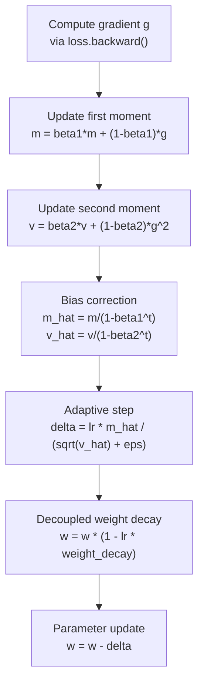

The key insight in this diagram is that weight decay (`WD`) is a separate operation from the adaptive step (`STEP`). In vanilla Adam with L2 regularization, the L2 penalty term is added to the gradient before step computation, which means the adaptive scaling affects the regularization strength differently for each parameter. In AdamW, because weight decay happens after the adaptive step as a direct multiplication, every parameter is shrunk by the same fraction `lr * weight_decay` regardless of its gradient history, making the regularization effect consistent and predictable.

| # | Variable | Role | Typical Default | What Happens If Too Large |
| --- | --- | --- | --- | --- |
| 1 | `lr` | Global step size multiplier | 1e-3 | Divergence or oscillation |
| 2 | `weight_decay` | Per-step weight shrink fraction | 1e-2 | Underfitting; weights collapse to zero |
| 3 | `beta1` | First moment decay rate | 0.9 | Gradient estimates react too slowly |
| 4 | `beta2` | Second moment decay rate | 0.999 | Variance estimates overfit recent batches |
| 5 | `eps` | Denominator stability constant | 1e-8 | Very rarely causes issues; leave at default |

> [!IMPORTANT]
> PyTorch's `AdamW` implementation uses `amsgrad=False` by default. AMSGrad is a variant that uses the maximum of past second moments instead of the running average, which provides stronger theoretical convergence guarantees but often performs similarly in practice. The default is correct for most use cases.

---

## Project Goals

This project has five explicit engineering goals that shape every design decision from module boundaries to CLI flags. The goals are stated here so that when you read the code or extend the project, you understand what tradeoffs were made intentionally versus accidentally.

The first goal is **clarity**: every piece of logic lives in the module most naturally responsible for it, so there is never a question of where to look when debugging or extending behavior. The second goal is **reproducibility**: **seeds** (fixed starting values for random number generators) are set at the start of every run, and all configurable parameters flow through explicit config **dataclasses** (typed, immutable Python objects) rather than global state or ambient variables. The third goal is **scheduler exploration**: the project is explicitly designed to make it easy to compare **LR schedule policies** (algorithms that change the learning rate during training) by swapping a single CLI flag without changing any source code. The fourth goal is **production habits**: metrics are persisted to **JSON** (a portable text-based data format) and plots to **PNG** (a lossless image format) after every run so there is a permanent audit trail without requiring external tooling. The fifth goal is **portability**: the code defaults to CPU and only activates **CUDA**-specific features like **AMP** (Automatic Mixed Precision, which uses 16-bit floats to save memory and speed up GPU training) when a GPU is present.

| # | Goal | Concrete Behavior | Why This Goal Exists |
| --- | --- | --- | --- |
| 1 | Clarity | One module per concern; no cross-cutting logic | Reduces time to locate bugs and onboard contributors |
| 2 | Reproducibility | set_seed covers Python, NumPy, and Torch RNGs | Ensures experiments are comparable across machines and runs |
| 3 | Scheduler exploration | Four scheduler modes switchable via one CLI arg | Makes scheduler comparison the primary experimental workflow |
| 4 | Production habits | JSON history and PNG curves persisted after every run | Builds artifact hygiene without requiring external tools |
| 5 | Portability | CPU-first logic; CUDA features activate when available | Runs correctly on laptops and GPU clusters with identical commands |

> [!NOTE]
> The synthetic Gaussian classification dataset is an intentional design choice, not a limitation. It removes data pipeline complexity entirely so 100% of focus stays on optimizer and scheduler behavior. You can swap in any real dataset by replacing `get_dataloaders` in `src/data.py` with a function that returns the same `(train_loader, val_loader)` tuple interface.

---

## Reader Guide

This README is a working technical reference document. It is longer than a typical README because it explains the reasoning behind each design choice, not just the interface. Different readers will want different entry points depending on their goal, so the table below maps common reader roles to the most efficient reading path through the document.

If you are a new contributor, the fastest productive path is Quickstart, then Training Lifecycle, then the Collapsible API Reference. If you are an ML researcher interested in scheduler dynamics, jump directly to Learning-Rate Schedulers and CLI Reference. If you are a maintainer evaluating the codebase for changes, System Architecture and Architecture Decisions give the clearest picture of what is safe to modify and what constraints exist.

> [!TIP]
> Use the Table of Contents at the top to jump directly to the section you need. Every major section is independently readable and does not depend on prior sections being read first.

| # | Reader Role | Best Entry Point | Then Read | Skip For Now |
| --- | --- | --- | --- | --- |
| 1 | New contributor | Quickstart | Training Lifecycle | Architecture Decisions |
| 2 | ML researcher | Learning-Rate Schedulers | AdamW Hyperparameter Guide | Model Architecture |
| 3 | Platform maintainer | System Architecture | Collapsible API Reference | Reader Guide |
| 4 | Code reviewer | Project Goals | Architecture Decisions | Quickstart |
| 5 | DevOps and CI owner | CLI Reference | CI/CD Pipeline | Tech Stack Deep Dive |
| 6 | First-time ML learner | Glossary | What Is AdamW? | Architecture Decisions |
| 7 | Researcher extending optimizers | How AdamW Works Internally | Extending the Project | Quickstart |

---

## Quickstart

Getting from zero to a completed training run takes four commands. The virtual environment ensures dependency isolation, and the training script runs without GPU hardware using sensible CPU defaults. The whole setup process takes under two minutes on a standard development machine. The venv approach is strongly preferred over a global pip install because PyTorch wheel sizes are large and the CUDA wheel variant must match your driver version; isolating this to a project-local venv prevents version conflicts with other projects.

```bash
python -m venv .venv
source .venv/bin/activate
pip install -r requirements.txt
python src/main.py
```

The default run trains for 30 epochs on 6000 synthetic samples using the cosine annealing scheduler. Artifacts are written to `artifacts/` and a two-panel training curve plot is saved as `curves.png`.

> [!TIP]
> For fast iteration while exploring scheduler behavior, use `--epochs 5 --n-samples 2000 --batch-size 64`. Full-length runs are only needed once you have settled on a configuration worth comparing carefully.

| # | Command | What It Does | Expected Output |
| --- | --- | --- | --- |
| 1 | `python -m venv .venv` | Creates isolated Python environment | `.venv/` directory created in project root |
| 2 | `source .venv/bin/activate` | Activates environment for current shell | Shell prompt changes to show active venv |
| 3 | `pip install -r requirements.txt` | Installs torch, numpy, and matplotlib | Packages downloaded and installed into venv |
| 4 | `python src/main.py` | Runs default training with cosine scheduler | Epoch logs printed; artifacts saved |
| 5 | `ls artifacts/` | Verifies outputs exist | `history.json` and `curves.png` listed |

> [!IMPORTANT]
> Always activate the virtual environment before running any training command. Using the system Python will fail with `ModuleNotFoundError` if PyTorch is not globally installed. If you see this error, check your shell prompt for the venv indicator before re-running.

### Scheduler Quick Examples

```bash
# Cosine annealing - default, smooth decay, good general-purpose choice
python src/main.py --scheduler cosine --scheduler-t-max 30 --min-lr 1e-5

# OneCycleLR - ramps up then decays; often faster early convergence
python src/main.py --scheduler onecycle --epochs 30 --lr 1e-3 --onecycle-pct-start 0.3

# LinearLR - simple monotonic decay from initial LR to min_lr
python src/main.py --scheduler linear --epochs 30 --min-lr 1e-5

# No scheduler - flat LR; useful as ablation baseline
python src/main.py --scheduler none

# Short smoke run - verifies full pipeline on CPU in seconds
python src/main.py --epochs 2 --n-samples 512 --batch-size 64 --scheduler cosine --no-amp
```

### Running Tests

```bash
# Full test suite (35 tests, all should pass)
python -m pytest tests/ -v

# Run only scheduler tests
python -m pytest tests/test_scheduler.py -v

# Run only evaluation tests
python -m pytest tests/test_evaluate.py -v

# Run with coverage report
python -m pytest tests/ --tb=short -q
```

> [!NOTE]
> The test suite uses `pytest` with a `conftest.py` that suppresses expected PyTorch scheduler-ordering warnings. All 35 tests should pass in under 5 seconds on CPU. If a test fails, it most likely indicates a regression in `src/train.py` or `src/evaluate.py`.

---

## Project Structure

The repository keeps a flat, predictable layout. Source code lives under `src/`, experiment notebooks under `notebooks/`, and all training outputs under `artifacts/`. Configuration and CI files follow standard GitHub repository conventions at the root level. This structure is deliberately conventional so contributors familiar with any Python project can navigate it immediately.

```text
ml-adamw-demo/
|-- .github/
|   |-- workflows/
|   |   `-- ci.yml              <- GitHub Actions CI pipeline
|   |-- ISSUE_TEMPLATE/
|   |   |-- bug_report.md
|   |   `-- feature_request.md
|   |-- PULL_REQUEST_TEMPLATE.md
|   |-- CODEOWNERS
|   `-- dependabot.yml
|-- .gitignore
|-- README.md
|-- CONTRIBUTING.md
|-- SECURITY.md
|-- requirements.txt
|-- artifacts/                  <- Created on first training run
|   `-- history.json
|-- notebooks/
|   `-- exploration.ipynb
`-- src/
    |-- data.py                 <- Synthetic dataset and DataLoader creation
    |-- evaluate.py             <- Validation loop
    |-- main.py                 <- CLI entry point and run orchestration
    |-- model.py                <- MLP classifier definition
    |-- train.py                <- Training loop, optimizer, scheduler factory
    `-- utils.py                <- Seeding, device, metrics I/O, plotting
```

> [!NOTE]
> The `artifacts/` directory is excluded from version control via `.gitignore`. Each run writes output files to this directory. Use `--artifacts-dir` to specify a named subdirectory per experiment so runs do not overwrite each other. This is the simplest possible experiment management strategy before adopting a full experiment tracking system.

---

## System Architecture

The architecture follows a strict layered design where each module has a single well-defined responsibility and dependencies only flow downward through the stack. The entry point `main.py` is the only module aware of all others. Every other module is unaware of the modules above it, which makes unit testing and module replacement straightforward without cascading side effects.

The data layer produces DataLoaders and knows nothing about the model or optimizer. The model layer defines architecture and knows nothing about training logic or data. The training layer runs the optimization loop and delegates validation to the evaluation layer. Utility functions are stateless helpers used by any layer that needs them. This separation is what makes it possible to swap out the model, change the dataset, or modify the training loop independently without touching other parts of the codebase.

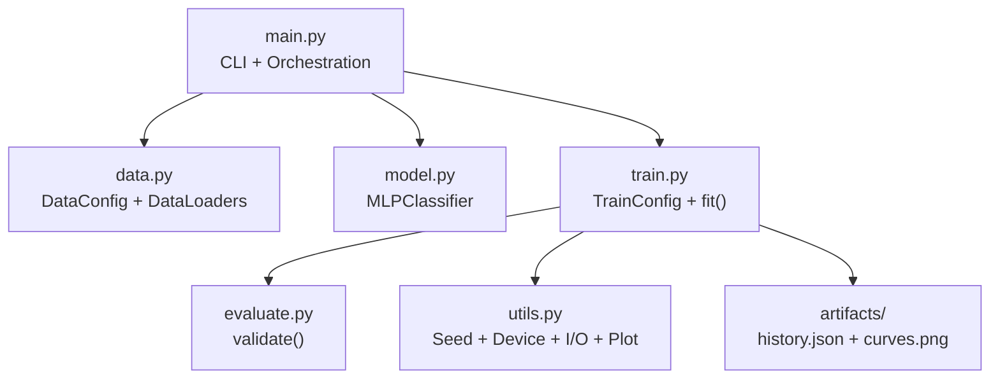

This dependency graph shows that `main.py` is the only module that wires everything together. No other module imports `main.py`, which prevents circular dependencies and keeps the entry point as the single composition root. This pattern is sometimes called the "composition root" pattern and is an important property for testability because each module can be instantiated and tested in isolation.

| # | Module | Layer | Depends On | Depended On By |
| --- | --- | --- | --- | --- |
| 1 | `src/main.py` | Orchestration | All modules | Nothing |
| 2 | `src/data.py` | Data | torch, numpy | main.py |
| 3 | `src/model.py` | Model | torch | main.py, train.py |
| 4 | `src/train.py` | Training | model, evaluate, utils | main.py |
| 5 | `src/evaluate.py` | Evaluation | torch | train.py |
| 6 | `src/utils.py` | Utilities | torch, matplotlib, json | train.py, main.py |

> [!TIP]
> To add a new model architecture, create a new class in `src/model.py` and update the model construction call in `src/main.py`. Nothing in the training or evaluation layers needs to change as long as the new model is an `nn.Module` that accepts the correct input shape and produces logits. This is the most common extension point.

---

## Tech Stack Deep Dive

The technology choices in this project are deliberately conservative. Every dependency earns its place by providing functionality that would require significant engineering effort to replicate from scratch, and no dependency is included for convenience alone. Understanding why each tool is here helps you evaluate whether to keep it or replace it when adapting this project to a new context.

**Python** is the language of choice because of its deep ecosystem integration with scientific computing and machine learning tooling. The standard library features used here, specifically `argparse`, `dataclasses`, `json`, and `pathlib`, are stable, well-documented, and require no additional installation. Using dataclasses for configuration gives the benefits of typed, immutable config objects without any third-party dependency. Python 3.10+ is required because the code uses structural pattern matching syntax for argument handling and union type annotations in the `X | Y` form rather than `Union[X, Y]`.

**PyTorch** is the core framework. It provides tensor computation with automatic differentiation, the AdamW optimizer implementation, all four learning-rate schedulers used here, automatic mixed precision via `torch.autocast` and `torch.amp.GradScaler`, and the DataLoader infrastructure for batched training. PyTorch is chosen over TensorFlow or JAX because its dynamic computation graph makes the training loop code straightforward to read and debug, and because its optimizer and scheduler APIs are close to the mathematical descriptions in papers. PyTorch's `nn.Module` base class provides the parameter tracking and train/eval mode switching that the training and evaluation modules rely on.

**NumPy** is used in the data generation layer to produce the synthetic Gaussian classification dataset and in plotting utilities to handle numeric array operations. It is not in the hot path of the training loop, so it does not affect training performance. It is included as a first-class dependency rather than an indirect one because the data generation logic depends on NumPy's random state management. NumPy's `RandomState` is seeded independently from PyTorch's RNG to ensure that data generation is reproducible across environments where PyTorch may be built with different underlying BLAS libraries.

**Matplotlib** renders training curves to PNG files after each run. The output is a two-panel figure showing loss and accuracy over epochs with separate lines for train and validation splits. Saving to PNG rather than showing interactive plots means visualization works equally well in headless CI environments and interactive development sessions. The `Agg` backend is used automatically in non-display environments, which prevents `$DISPLAY` errors in Docker containers and CI runners.

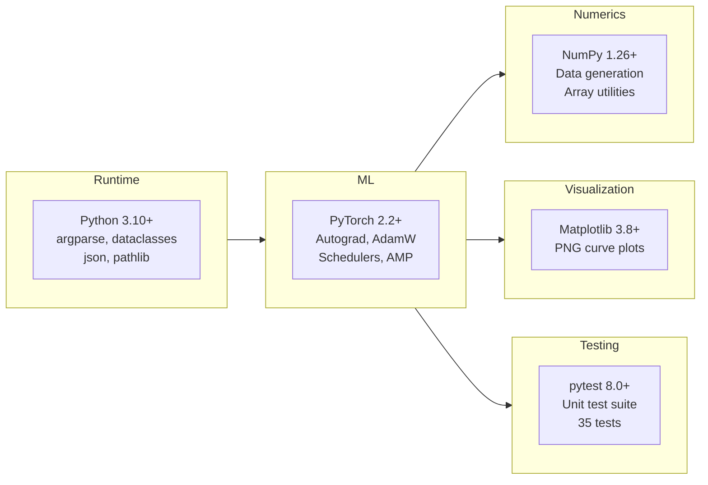

| # | Dependency | Version Minimum | Role in Project | Why This Library | Key API Used |
| --- | --- | --- | --- | --- | --- |
| 1 | Python | 3.10 | Language runtime and stdlib | Match-statement annotation syntax; stable LTS releases | argparse, dataclasses, json, pathlib |
| 2 | PyTorch | 2.2 | Tensors, autograd, optimizers, AMP | Native AdamW and OneCycleLR; strong CUDA AMP support | torch.optim.AdamW, autocast, GradScaler |
| 3 | NumPy | 1.26 | Synthetic data generation; array ops | Standard scientific computing interface; seeded RNG | numpy.random, numpy.ndarray |
| 4 | Matplotlib | 3.8 | Render training curve PNGs | Headless PNG output; no display server required | pyplot.figure, pyplot.savefig |
| 5 | pytest | 8.0 | Unit test runner | Industry standard; parametrize and conftest fixtures | pytest.mark.parametrize, conftest.py |

> [!NOTE]
> The `requirements.txt` pins minimum versions rather than exact versions to remain compatible with system PyTorch installations on machines where CUDA driver versions constrain the available PyTorch build. If you need exact bit-for-bit reproducibility across machines, pin exact versions and include the CUDA wheel suffix for torch, for example `torch==2.2.0+cu121`.

---

## Dataset and Data Pipeline

The project uses a fully synthetic multi-class Gaussian classification dataset generated fresh at the start of every training run. Each class is represented as a cluster of points drawn from a multivariate Gaussian distribution with a class-specific mean vector and shared unit covariance. The number of classes, the number of features per sample, and the total dataset size are all configurable at runtime via CLI flags.

Using a synthetic dataset rather than a real-world dataset is a deliberate design choice. Synthetic datasets eliminate three categories of external variability that would otherwise interfere with studying optimizer and scheduler behavior: data download failures, class imbalance in natural data, and unknown distributional properties that affect convergence speed. Because the Gaussian clusters are linearly separable in most configurations, the MLP model reaches high accuracy quickly, which means differences in training dynamics appear as differences in convergence speed and smoothness rather than differences in final accuracy.

> [!NOTE]
> The synthetic dataset is seeded by the same global RNG seed used for model initialization. This means that two runs with identical `--seed` values will generate identical datasets and initialize the model with identical weights, making their training curves directly comparable. If you change the seed, both the data and the model initialization change simultaneously.

The data pipeline in `src/data.py` handles five operations: generating the raw feature matrix and label vector, splitting into train and validation subsets by `val_fraction`, converting NumPy arrays to PyTorch tensors, wrapping in `TensorDataset` objects, and creating `DataLoader` instances with appropriate shuffle settings. The training loader shuffles samples between epochs; the validation loader does not. Both use the same batch size.

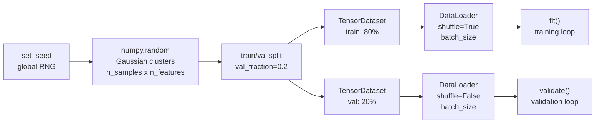

| # | DataConfig Field | Default | Effect on Data | Effect on Training |
| --- | --- | --- | --- | --- |
| 1 | `n_samples` | 6000 | Total sample count before split | More samples: slower epochs; better generalization signal |
| 2 | `n_features` | 20 | Input feature dimension | Higher: larger first linear layer; slower per-sample |
| 3 | `n_classes` | 2 | Number of Gaussian cluster centers | Higher: larger output layer; harder classification task |
| 4 | `val_fraction` | 0.2 | Fraction of samples reserved for val | Higher: fewer training samples; better val estimate |
| 5 | `batch_size` | 128 | Samples per DataLoader batch | Higher: smoother gradients; more memory per step |
| 6 | `seed` | 42 | RNG seed for data generation | Different seeds produce different cluster layouts |

> [!TIP]
> If you want to study how dataset difficulty affects scheduler behavior, increase `n_classes` (more classes means harder classification) or reduce `n_features` (lower-dimensional data may produce less separable clusters depending on the RNG seed). Both changes are single-flag modifications with no code changes.

---

## Model Architecture

The model used in this project is a **multi-layer perceptron (MLP)** classifier - a feedforward neural network made of stacked fully-connected layers - implemented in `src/model.py`. It accepts a flat feature vector of configurable dimension, passes it through two hidden layers with **ReLU** activations (a non-linear function `max(0, x)` that lets the network learn curved decision boundaries) and **dropout** regularization (random zeroing of activations during training to prevent co-adaptation), and produces a **logit** vector (raw unnormalized scores, one per class) over the output classes. The architecture is deliberately simple so that training dynamics are dominated by optimizer and scheduler behavior rather than model complexity.

The two-hidden-layer MLP is a strong baseline for classification on low-to-medium dimensional feature spaces. It has enough capacity to learn non-linear decision boundaries while remaining fast to train on CPU. The dropout regularization in each hidden layer discourages co-adaptation of neurons, which slightly regularizes the model and makes the effect of `weight_decay` more observable in validation curves.

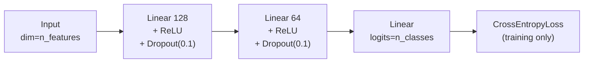

The MLP is not intended to be state-of-the-art for any particular task. Its purpose is to provide a realistic training target where the optimizer and scheduler choices produce meaningfully different learning curves. The synthetic Gaussian dataset produces separable clusters, so the model reaches high accuracy quickly and differences between scheduler strategies appear in convergence speed and smoothness rather than final accuracy.

| # | Layer | Type | Output Shape | Configuration |
| --- | --- | --- | --- | --- |
| 1 | Input | Passthrough | (batch, n_features) | Configurable via `--n-features`; default 20 |
| 2 | Hidden 1 | Linear + ReLU + Dropout | (batch, 128) | Default `hidden_dims[0]`; dropout=0.1 |
| 3 | Hidden 2 | Linear + ReLU + Dropout | (batch, 64) | Default `hidden_dims[1]`; dropout=0.1 |
| 4 | Output | Linear | (batch, n_classes) | Logits only; no softmax applied inside model |
| 5 | Loss | CrossEntropyLoss | scalar | Applied in training loop; includes implicit softmax |

> [!NOTE]
> Dropout is active only during training. The `validate()` function calls `model.eval()` before inference, which disables dropout and any batch normalization layers automatically via PyTorch's training-mode tracking. The model is restored to `model.train()` after each validation pass. This `eval()`/`train()` mode restoration is safety-critical: forgetting to restore train mode after validation would silently disable dropout for all subsequent training batches.

> [!IMPORTANT]
> The model outputs raw logits, not probabilities. Do not apply softmax before passing to `CrossEntropyLoss`; it applies log-softmax internally. Applying softmax twice produces numerically incorrect results that are difficult to diagnose because the model still trains but converges to worse solutions.

---

## Training Lifecycle

A complete training run proceeds through a well-defined lifecycle from CLI argument parsing through artifact persistence. Understanding each phase helps when adding new functionality such as **early stopping** (halting training when validation loss stops improving), **model checkpointing** (saving weights when a new best validation loss is achieved), **gradient clipping** (capping gradient magnitude to prevent exploding updates), or custom per-epoch callbacks.

The training loop in `src/train.py` explicitly separates per-batch logic from per-epoch logic. Per-batch logic includes the forward pass, loss computation, backward pass, optimizer step, and OneCycleLR scheduler step when OneCycleLR is selected. Per-epoch logic includes the validation pass, non-OneCycleLR scheduler steps, and history recording. This separation is what allows different schedulers to use the correct step timing without requiring special cases scattered throughout the loop body.

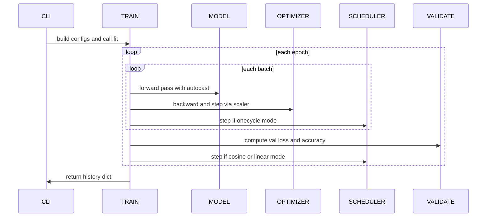

> [!IMPORTANT]
> The `scheduler_step_on_batch` boolean returned by `_build_scheduler` determines which branch of the scheduler step runs. This flag is set once at construction and evaluated every batch and every epoch. It is what keeps OneCycleLR stepping per-batch while CosineAnnealingLR and LinearLR step per-epoch without requiring isinstance checks in the loop body.

| # | Phase | Location in Code | What Happens | Why Here |
| --- | --- | --- | --- | --- |
| 1 | Argument parsing | `main.py:parse_args` | CLI flags parsed into Namespace | Must precede all config construction |
| 2 | Config assembly | `main.py:main` | DataConfig and TrainConfig built from args | Immutable configs prevent mid-run mutation |
| 3 | Data loading | `data.py:get_dataloaders` | Gaussian clusters generated and split | Seeded before model init for reproducibility |
| 4 | Model construction | `model.py:MLPClassifier` | MLP layers initialized with random weights | Architecture fixed before optimizer is built |
| 5 | Optimizer creation | `train.py:fit` | AdamW initialized with model parameters | Optimizer must receive parameter references at init |
| 6 | Scheduler creation | `train.py:_build_scheduler` | Scheduler built; step_on_batch flag set | Step timing decision made once at construction |
| 7 | Per-batch training | `train.py:_train_one_epoch` | Forward, loss, backward, optimizer step | Core learning step; AMP applied here if enabled |
| 8 | Per-epoch validation | `evaluate.py:validate` | No-grad inference on validation split | Generalization signal; no gradients computed |
| 9 | Epoch scheduler step | `train.py:fit` | CosineAnnealingLR or LinearLR stepped | Epoch-level schedulers must update LR here |
| 10 | Checkpoint save | `train.py:fit` | Best-val-loss weights saved if improved | Preserves best weights seen across all epochs |
| 11 | Artifact persistence | `utils.py` | JSON and PNG written to artifacts directory | Permanent record; happens after training completes |

> [!WARNING]
> Do not call `optimizer.step()` directly when AMP is enabled. The `GradScaler` wraps the optimizer step internally via `scaler.step(optimizer)`. Bypassing the scaler causes unscaled gradients to update parameters, which defeats the purpose of AMP and can cause numerical instability. The existing code handles this correctly; preserve this pattern when making changes.

---

## AMP and GPU Acceleration

Automatic Mixed Precision (AMP) is a training technique that computes most operations in 16-bit floating point (`float16` or `bfloat16`) while keeping a 32-bit master copy of the weights and a small number of numerically sensitive operations (like softmax and loss computation) in full 32-bit precision. The benefit is a reduction in GPU memory bandwidth usage and faster matrix multiplication on NVIDIA Tensor Core hardware, which translates directly to shorter training time and the ability to fit larger batch sizes in GPU memory.

AMP in PyTorch involves two components working together. The first is `torch.autocast`, a context manager that automatically selects the appropriate dtype for each operation within its scope. Operations like linear layers and convolutions run in `float16`; operations requiring full precision run in `float32`. The second component is `torch.amp.GradScaler`, which handles a subtle numerical problem: gradients computed in `float16` can underflow to zero if their magnitude is very small, which silently stops learning. GradScaler solves this by multiplying the loss by a large scale factor before the backward pass, computing gradients in float16 at the scaled magnitude, then dividing the gradients back down before the optimizer step. The scale factor adapts dynamically based on whether any gradients overflow during the run.

> [!NOTE]
> AMP is automatically disabled when no CUDA device is present. The `use_amp` flag in `TrainConfig` is set to `True` only when `get_device()` returns `cuda` and `--no-amp` is not passed. On CPU, `torch.autocast` with `device_type="cpu"` is technically supported but provides no performance benefit and can occasionally cause precision-related numerical differences. The project always disables AMP on CPU to avoid this.

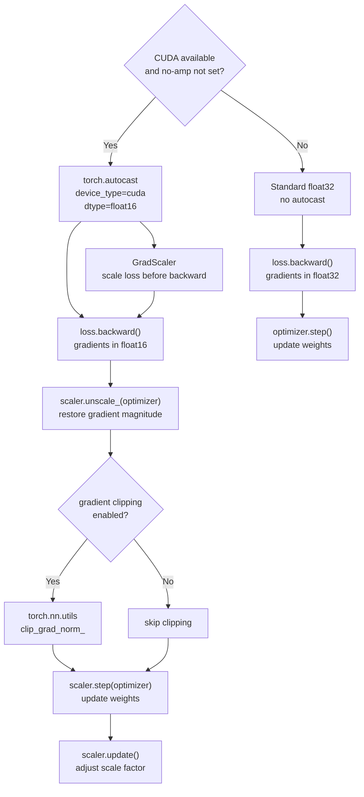

| # | Scenario | AMP Active | GradScaler Active | Expected Speedup |
| --- | --- | --- | --- | --- |
| 1 | NVIDIA GPU, no `--no-amp` | Yes | Yes | 1.5x to 3x depending on GPU generation |
| 2 | NVIDIA GPU with `--no-amp` | No | No (identity) | Baseline; use for debugging numerical issues |
| 3 | CPU | No | No (identity) | No benefit; disabled automatically |
| 4 | Non-CUDA GPU (MPS, etc.) | No | No | AMP not supported; disabled automatically |

> [!CAUTION]
> On some older NVIDIA GPU generations (pre-Turing architecture, i.e. before RTX 2000 series), AMP may not provide speedup because Tensor Cores are not available. Training will still be numerically correct, just no faster than float32. To check your GPU architecture, run `nvidia-smi --query-gpu=name --format=csv,noheader`.

---

## Learning-Rate Schedulers

**Learning-rate scheduling** is the practice of changing the learning rate (the step size used for each parameter update) according to a policy during training. It is one of the highest-impact decisions in a training run. A good schedule can reduce training time, improve final validation accuracy, and prevent loss spikes late in training. A poorly matched schedule can cause early **divergence** (loss growing uncontrollably instead of decreasing), oscillating validation metrics, or premature convergence to a suboptimal solution. This project supports four scheduler modes and is designed to make comparing them as frictionless as possible.

The fundamental insight behind LR scheduling is that the optimal step size changes over the course of training. Early in training, large steps help explore the loss landscape quickly and escape bad initializations. Later in training, smaller steps allow the optimizer to settle into the bottom of a local minimum without repeatedly overshooting. Different schedulers model this intuition differently, each with tradeoffs in simplicity, control, and convergence behavior.

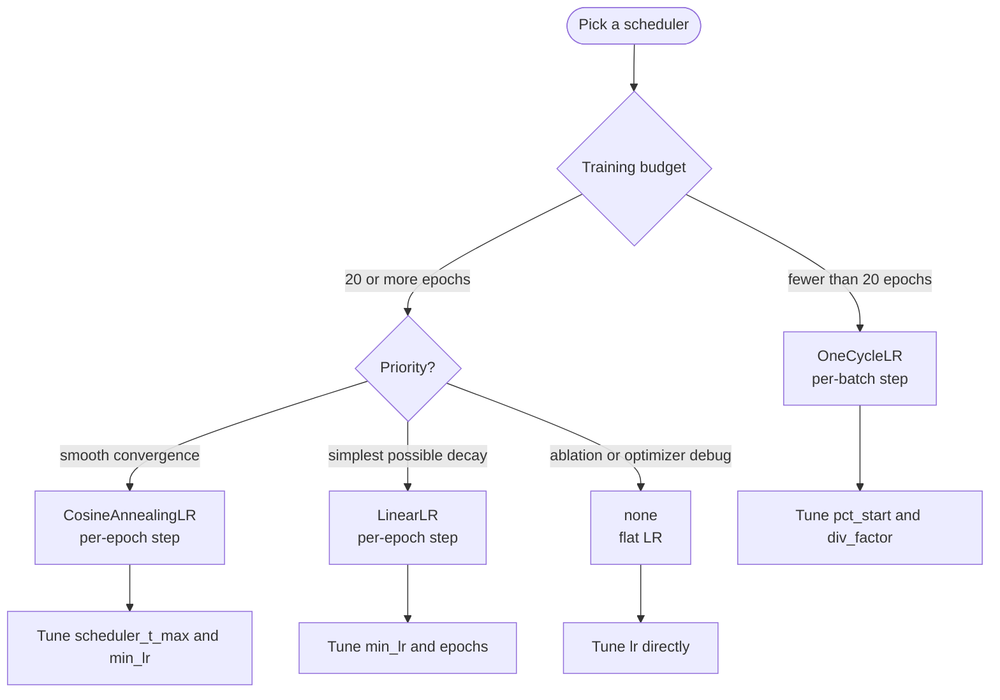

> [!IMPORTANT]
> `OneCycleLR` must call `scheduler.step()` after every batch, not after every epoch. Stepping it once per epoch produces an incorrect LR curve that misses the warmup phase entirely and may cause divergence. The code enforces per-batch stepping via `scheduler_step_on_batch=True`. If you add a scheduler that also requires per-batch stepping, set this flag to `True` in `_build_scheduler`.

| # | Scheduler | Implemented | Step Timing | LR Curve Shape | Best For |
| --- | --- | --- | --- | --- | --- |
| 1 | `none` | Yes | Never | Flat | Ablation; isolating optimizer behavior from schedule |
| 2 | `CosineAnnealingLR` | Yes | Per epoch | Cosine decay from lr to eta_min | Long stable runs; fine-tuning pretrained models |
| 3 | `OneCycleLR` | Yes | Per batch | Warmup then cosine decay | Short aggressive runs; fast convergence |
| 4 | `LinearLR` | Yes | Per epoch | Linear decay from lr to min_lr | Simple monotonic schedule; controlled baselines |
| 5 | `ReduceLROnPlateau` | Planned | Per epoch with metric | Step-down on validation stagnation | Adaptive decay when plateau behavior is expected |
| 6 | `CosineAnnealingWarmRestarts` | Planned | Per epoch | Periodic cosine resets | Non-stationary training; SGDR-style warm restarts |

**CosineAnnealingLR** is the default scheduler. It decays the learning rate from its initial value toward `eta_min` following a cosine curve over `T_max` epochs. The cosine shape means decay is slow at first, accelerates through the middle of training, and slows again near the end. This matches the empirical observation that large LR reductions are most useful in the middle of training rather than at the very start or end. Set `T_max` equal to the total number of epochs for a single smooth decay cycle.

**OneCycleLR** implements a one-cycle policy where the LR first increases from a low starting value to `max_lr` and then decreases to a very low final value. The warmup phase helps the optimizer escape poor early initialization while the aggressive final decay helps converge to a tight minimum. The `pct_start` parameter controls what fraction of total steps are spent in warmup; the default is 30%, meaning the LR rises for the first 30% of training and falls for the remaining 70%.

**LinearLR** provides the simplest possible decay: a straight line from the initial LR multiplied by `start_factor` down to `end_factor * initial_lr` over `total_iters` epochs. It is the most predictable schedule when you need to know exactly what the LR will be at any given epoch without computing cosine values. Linear decay is easy to reason about and easy to explain to stakeholders who are not familiar with scheduler mathematics.

| # | Scheduler Parameter | Applies To | Effect | Starting Value |
| --- | --- | --- | --- | --- |
| 1 | `--scheduler-t-max` | cosine | Cosine half-cycle length in epochs | Set equal to total epochs |
| 2 | `--min-lr` | cosine, linear | LR floor that schedule decays toward | 1e-5 |
| 3 | `--onecycle-pct-start` | onecycle | Fraction of total steps spent warming up | 0.3 |
| 4 | `--onecycle-div-factor` | onecycle | Sets initial_lr = max_lr / div_factor | 25.0 |
| 5 | `--onecycle-final-div-factor` | onecycle | Sets final min_lr = initial_lr / final_div_factor | 1e4 |

> [!CAUTION]
> Comparing schedulers is only statistically meaningful when seed, dataset size, batch size, LR, and weight decay are all held fixed. Even a different random seed can introduce enough variance to obscure real scheduler differences on small datasets. Use `--artifacts-dir` to direct each run to a named folder and document the exact CLI command used to produce each result.

---

## Scheduler Mathematical Reference

Understanding the precise formula each scheduler uses to compute the learning rate at each step makes debugging unexpected LR behavior significantly easier. This section gives the closed-form expressions for each scheduler and notes the parameters that control them.

**CosineAnnealingLR** computes the learning rate at epoch `t` as:

```
lr(t) = eta_min + 0.5 * (lr_0 - eta_min) * (1 + cos(pi * t / T_max))
```

Where `lr_0` is the initial learning rate, `eta_min` is the minimum LR floor (`--min-lr`), and `T_max` is the half-cycle length in epochs (`--scheduler-t-max`). At `t=0`, the formula gives `lr_0`. At `t=T_max`, the formula gives `eta_min`. The cosine term provides the characteristic slow-fast-slow decay profile.

**LinearLR** decays linearly from `start_factor * lr_0` to `end_factor * lr_0` over `total_iters` epochs:

```
lr(t) = lr_0 * (start_factor + (end_factor - start_factor) * t / total_iters)
```

In this project, `start_factor=1.0` and `end_factor = min_lr / lr_0`, so the LR starts at `lr_0` and ends at `min_lr`.

**OneCycleLR** uses a piecewise function. During warmup (`t <= pct_start * total_steps`), the LR ramps from `max_lr / div_factor` to `max_lr`. After warmup, it decays from `max_lr` to `max_lr / (div_factor * final_div_factor)` via a cosine decay. The total number of steps is `epochs * steps_per_epoch`.

> [!NOTE]
> All three scheduler formulas above use the learning rate stored in the optimizer's parameter group, not a separate internal state variable. You can always inspect the current LR during training with `optimizer.param_groups[0]["lr"]`. The `history["lr"]` array in the saved JSON captures this value at the end of each epoch.

| # | Scheduler | Formula Variables | Step Frequency | Period per Cycle |
| --- | --- | --- | --- | --- |
| 1 | CosineAnnealingLR | `lr_0`, `eta_min`, `T_max`, `t` | Per epoch | T_max epochs |
| 2 | LinearLR | `lr_0`, `start_factor`, `end_factor`, `total_iters`, `t` | Per epoch | total_iters epochs |
| 3 | OneCycleLR | `max_lr`, `div_factor`, `final_div_factor`, `pct_start`, `total_steps` | Per batch | total_steps batches |
| 4 | None | N/A - constant | Never | Infinite |

---

## AdamW Hyperparameter Guide

Choosing good AdamW hyperparameters has a larger effect on training outcomes than model architecture in many practical settings. This section explains each parameter mechanistically and gives systematic guidance for tuning. The general principle is to start with the defaults provided here, run a short diagnostic training session, and then adjust parameters one at a time based on the diagnostic signals described below.

**Learning rate** (`--lr`) controls the step size for each parameter update. It is the single most important **hyperparameter** (a value set before training that is not learned from data, as opposed to weights which are learned) in any gradient-based training setup. Set it too high and training diverges. Set it too low and training converges slowly or stalls entirely in a **plateau** (a region of the loss surface where the gradient is near zero and progress stops). The default `1e-3` is a well-tested starting point, but treat it as an initial guess rather than a fixed value. For fine-tuning pretrained models, a learning rate in the range `1e-5` to `1e-4` is often more appropriate because the pretrained weights are already near a good solution.

**Weight decay** (`--weight-decay`) applies L2-style regularization to model weights after each optimizer step. In AdamW this is done by multiplying each weight by `(1 - lr * weight_decay)` directly, independent of the gradient. Higher values push weights toward zero more aggressively, reducing overfitting at the cost of potentially underfitting if set too high. The default `1e-2` is a reasonable starting point for medium-sized networks trained from scratch. For very small models or simple tasks, try reducing to `1e-3`. For large models on complex tasks, values up to `1e-1` are sometimes used.

> [!TIP]
> A systematic tuning approach: start with `lr=1e-3` and `weight_decay=1e-2`. If training diverges in the first few epochs, reduce `lr` by 10x. If `val_loss` is much larger than `train_loss`, increase `weight_decay`. If both losses are high and not decreasing, the model may need more capacity or the task may require more data. If losses decrease but `val_acc` is stuck at chance level, check that the label tensor is correctly constructed.

| # | Parameter | Default | Increasing Causes | Decreasing Causes | Search Range |
| --- | --- | --- | --- | --- | --- |
| 1 | `--lr` | 1e-3 | Faster early progress; divergence risk | Slower convergence; more stable | 1e-4 to 1e-2 |
| 2 | `--weight-decay` | 1e-2 | Stronger regularization; underfitting risk | Weaker regularization; overfitting risk | 1e-4 to 1e-1 |
| 3 | `--batch-size` | 128 | Lower gradient variance; smoother loss | Higher gradient noise; implicit regularization | 32 to 512 |
| 4 | `--min-lr` | 1e-5 | Decays toward higher floor; less late refinement | Decays near zero; maximum final convergence | 0 to lr/100 |
| 5 | `--onecycle-pct-start` | 0.3 | Longer warmup; helps early instability | Shorter warmup; faster ramp to max_lr | 0.1 to 0.5 |

> [!IMPORTANT]
> AdamW's `beta1` and `beta2` parameters are not exposed as CLI flags in this project because they rarely need tuning. The defaults `beta1=0.9` and `beta2=0.999` work well for the vast majority of tasks. Only modify them if you have strong evidence from a diagnostic that the moment estimation is causing problems, such as consistently lagged response to loss changes (`beta1` too high) or erratic per-parameter scaling (`beta2` too low).

---

## Reproducibility and Experiment Design

Reproducibility is the property that running the same experiment twice produces identical results. In machine learning this is harder to achieve than in most software because randomness is introduced at multiple points: weight initialization, data shuffling, dropout masking, and optionally gradient noise from AMP. This project achieves reproducibility by seeding all RNG sources before any randomness is consumed.

The `set_seed` function in `src/utils.py` seeds four separate RNG sources. It seeds Python's built-in `random` module, NumPy's global random state, PyTorch's CPU RNG, and PyTorch's CUDA RNG (if CUDA is available). It also sets `torch.backends.cudnn.deterministic = True`, which disables CUDA's non-deterministic convolution algorithms and ensures that identical inputs produce identical outputs for convolutional layers. The tradeoff is a small performance penalty from disabling optimized non-deterministic kernels, which is acceptable for research but can be disabled for production throughput runs.

> [!WARNING]
> Even with all seeds set, results may not be bit-for-bit identical across different operating systems, hardware, or PyTorch versions. The random number generation algorithms used by NumPy and PyTorch have changed between versions. If you need strict cross-environment reproducibility, document the exact package versions using `pip freeze > requirements-frozen.txt` and reproduce using that file.

| # | Reproducibility Layer | Where Seeded | What It Controls | Risk If Not Seeded |
| --- | --- | --- | --- | --- |
| 1 | Python `random` | `set_seed` | Sampling and shuffling in pure Python | Non-deterministic data processing |
| 2 | NumPy global RNG | `set_seed` | Synthetic data generation | Different cluster layouts each run |
| 3 | PyTorch CPU RNG | `set_seed` | Weight init; data augmentation | Different initial weights each run |
| 4 | PyTorch CUDA RNG | `set_seed` | Dropout masks on GPU | Non-deterministic regularization |
| 5 | CuDNN determinism | `set_seed` | Conv algorithm selection | Non-deterministic forward passes on GPU |
| 6 | DataLoader shuffle | `batch_size` fixed | Batch ordering each epoch | Different training batch sequences |

> [!TIP]
> For rigorous scheduler comparison, run each scheduler configuration three times with seeds 42, 43, and 44, then report the mean and standard deviation of final `val_acc` across seeds. A scheduler that is meaningfully better should show a consistently higher mean, not just a single lucky seed result.

---

## CLI Reference

The **CLI** (Command-Line Interface) is the primary control surface for running experiments. Every parameter relevant to data, model, optimizer, and scheduler is exposed as a `--flag` argument so experiments are fully reproducible from the command used to run them. This means any experiment can be re-run exactly by copying the command from a shell log or CI output, with no source code changes required. Designing experiments as CLI invocations rather than code edits has several advantages: it makes experiment history easy to reconstruct from shell logs, it allows automation scripts and CI pipelines to drive training runs programmatically, and it allows the same codebase to serve as a reusable harness for many different experimental configurations without creating diverging code forks.

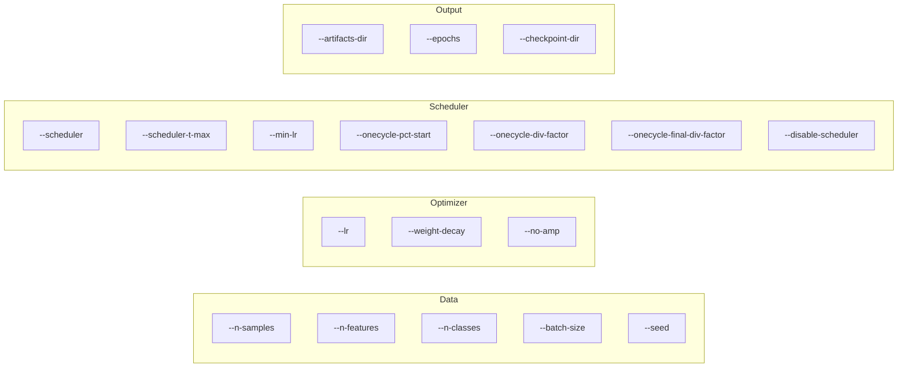

| # | Flag | Default | Type | Description |
| --- | --- | --- | --- | --- |
| 1 | `--seed` | 42 | int | Global RNG seed for full cross-run reproducibility |
| 2 | `--epochs` | 30 | int | Number of full passes over the training set |
| 3 | `--batch-size` | 128 | int | Samples per gradient update; affects noise and memory |
| 4 | `--n-samples` | 6000 | int | Total synthetic dataset size before split |
| 5 | `--n-features` | 20 | int | Input feature dimension for the MLP |
| 6 | `--n-classes` | 2 | int | Number of output classes |
| 7 | `--lr` | 1e-3 | float | Initial LR; also used as OneCycleLR max_lr |
| 8 | `--min-lr` | 1e-5 | float | LR floor for cosine and linear schedulers |
| 9 | `--weight-decay` | 1e-2 | float | AdamW decoupled weight decay coefficient |
| 10 | `--scheduler` | cosine | choice | Scheduler: none, cosine, onecycle, linear |
| 11 | `--scheduler-t-max` | =epochs | int | CosineAnnealingLR half-cycle length in epochs |
| 12 | `--onecycle-pct-start` | 0.3 | float | OneCycleLR fraction of steps spent in warmup |
| 13 | `--onecycle-div-factor` | 25.0 | float | OneCycleLR initial_lr = max_lr / div_factor |
| 14 | `--onecycle-final-div-factor` | 1e4 | float | OneCycleLR min_lr = initial_lr / final_div_factor |
| 15 | `--disable-scheduler` | False | flag | Hard override: forces scheduler=none |
| 16 | `--no-amp` | False | flag | Disables mixed precision even on CUDA |
| 17 | `--artifacts-dir` | artifacts | str | Output directory for history.json and curves.png |
| 18 | `--checkpoint-dir` | None | str | If set, saves best-val-loss weights to dir/best_model.pt |

> [!WARNING]
> `--disable-scheduler` overrides `--scheduler` completely. Passing `--scheduler cosine --disable-scheduler` runs with no scheduler. This override is intentional and exists for automation scripts that need a hard-coded no-scheduler baseline without changing the default `--scheduler` value.

---

## Outputs and Artifacts

Every training run produces two persistent outputs: a JSON file containing per-epoch metrics and a PNG file showing the training curves. These two outputs together give you the full picture of a run in both machine-readable and human-readable form, which is sufficient for most post-training analysis without additional tooling. The JSON is designed to be loaded directly by NumPy or pandas for statistical analysis; the PNG is designed to give an immediate visual summary without any additional scripts.

The JSON history file contains five arrays, each with one entry per epoch: `train_loss`, `train_acc`, `val_loss`, `val_acc`, and `lr`. The `lr` array records the learning rate at the end of each epoch, making it possible to reconstruct the exact LR schedule from the history file alone without re-running the experiment. The PNG file is a two-panel Matplotlib figure with loss on the left and accuracy on the right, each showing separate lines for train and validation splits.

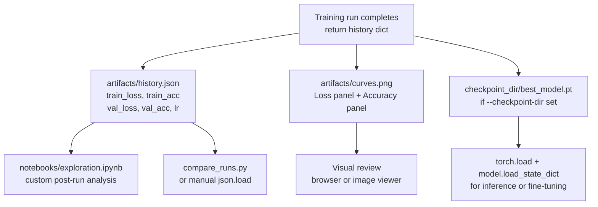

| # | Output | Path | Format | Contents | Primary Consumer |
| --- | --- | --- | --- | --- | --- |
| 1 | Metrics history | `artifacts/history.json` | JSON object | 5 float arrays, one entry per epoch | Scripts, notebooks, CI assertions |
| 2 | Training curves | `artifacts/curves.png` | PNG image | Two-panel loss and accuracy over epochs | Human visual review |
| 3 | Console log | stdout | Plain text | Per-epoch loss, acc, LR, and final best values | Terminal monitoring; redirect with `> run.log` |
| 4 | LR trace | `history["lr"]` in JSON | Float array | Learning rate at end of each epoch | Scheduler behavior verification |
| 5 | Best val metrics | Last two stdout lines | Text | Best `val_acc` and `val_loss` across all epochs | CI assertions via grep |
| 6 | Model checkpoint | `checkpoint_dir/best_model.pt` | PyTorch state dict | CPU model weights at best val_loss | Inference; fine-tuning; continued training |

> [!TIP]
> To compare multiple scheduler runs side by side, direct each run to a named artifacts directory with `--artifacts-dir artifacts/cosine-run-1` and so on, then load all the JSON files in `notebooks/exploration.ipynb`. The history format is identical across all scheduler modes so LR traces can be overlaid directly.

---

## Collapsible API Reference

This section provides a complete function-level reference for every public API in the project. It is organized by module and intended for maintainers and contributors who need to understand parameter contracts, return types, and internal behavior before making changes.

<!-- markdownlint-disable MD033 -->
<details>
<summary><strong>src/main.py - Entry Point and Orchestration</strong></summary>

### `parse_args() -> argparse.Namespace`

Parses all CLI arguments and returns a Namespace object. Every field maps directly to a CLI flag documented in the CLI Reference table. This function does no semantic validation beyond argparse type checking. Downstream config constructors apply semantic validation.

### `main() -> None`

Top-level orchestration function. Calls `set_seed`, constructs `DataConfig` and `TrainConfig` from parsed args, builds the model, calls `fit`, then calls `save_history` and `plot_history`. Returns nothing. Any exception propagates to the caller without wrapping so exit codes are reliable.

</details>

<details>
<summary><strong>src/data.py - Data Layer</strong></summary>

### `DataConfig`

Frozen dataclass holding all dataset and DataLoader configuration.

| # | Field | Type | Default | Meaning |
| --- | --- | --- | --- | --- |
| 1 | `n_samples` | int | 6000 | Total sample count before train/val split |
| 2 | `n_features` | int | 20 | Feature vector dimension fed to the MLP |
| 3 | `n_classes` | int | 2 | Number of classification output classes |
| 4 | `batch_size` | int | 128 | DataLoader batch size for both splits |
| 5 | `val_fraction` | float | 0.2 | Fraction of samples reserved for validation |
| 6 | `seed` | int | 42 | RNG seed used for data generation |

### `get_dataloaders(config: DataConfig) -> tuple[DataLoader, DataLoader]`

Generates a synthetic multi-class Gaussian classification dataset, splits it by `val_fraction`, wraps both splits in DataLoaders, and returns `(train_loader, val_loader)`. The training loader shuffles; the validation loader does not.

</details>

<details>
<summary><strong>src/model.py - Model Layer</strong></summary>

### `MLPClassifier`

```python
MLPClassifier(
    input_dim: int,
    num_classes: int,
    hidden_dims: tuple[int, ...] = (128, 64),
    dropout: float = 0.1,
)
```

Multi-layer perceptron classifier. Each element of `hidden_dims` produces a `Linear -> ReLU -> Dropout` block. The output layer is a single `Linear` projection to `num_classes` logits with no activation. Inherits from `nn.Module`.

**`forward(x: Tensor) -> Tensor`**: Forward pass. Input shape `(batch, input_dim)`. Output shape `(batch, num_classes)`.

</details>

<details>
<summary><strong>src/train.py - Training Layer</strong></summary>

### `TrainConfig`

Frozen dataclass holding all optimizer and scheduler configuration. All fields map 1:1 to CLI flags defined in `parse_args`. Includes optional `checkpoint_dir: str | None` field - if set, `fit()` saves `best_model.pt` to this directory whenever val_loss improves.

### `_build_scheduler(optimizer, config, steps_per_epoch) -> tuple[LRScheduler | None, bool]`

Internal factory. Constructs and returns the scheduler specified by `config.scheduler`, along with a boolean `scheduler_step_on_batch`. The boolean is `True` only for `OneCycleLR`. Raises `ValueError` for unrecognized scheduler name strings. Case-insensitive scheduler name matching.

### `fit(model, train_loader, val_loader, config, device) -> dict[str, list[float]]`

Main training loop. Constructs AdamW, calls `_build_scheduler`, runs `config.epochs` epochs, calls `validate` after each epoch, steps epoch-level schedulers, records all metrics, optionally saves checkpoint when val_loss improves, and returns the full history dictionary with keys `train_loss`, `train_acc`, `val_loss`, `val_acc`, `lr`.

### `_train_one_epoch(model, loader, criterion, optimizer, scheduler, scheduler_step_on_batch, scaler, device, use_amp) -> tuple[float, float]`

One epoch of training. Iterates the loader, applies `torch.autocast` when AMP is enabled, computes CE loss, runs backward through `GradScaler`, steps optimizer, and steps scheduler per-batch if `scheduler_step_on_batch` is True. Returns `(mean_loss, mean_accuracy)`.

</details>

<details>
<summary><strong>src/evaluate.py and src/utils.py - Evaluation and Utilities</strong></summary>

### `validate(model, loader, criterion, device, use_amp) -> tuple[float, float]`

No-grad validation pass. Calls `model.eval()` at the start and `model.train()` at the end (critical - forgetting this disables dropout for subsequent training). Applies the same AMP autocast logic as training for numerical consistency. Returns `(mean_loss, mean_accuracy)`. Returns `(0.0, 0.0)` if the loader is empty.

### `set_seed(seed: int) -> None`

Sets seeds on `random`, `numpy.random`, `torch`, and `torch.cuda`. Also sets `torch.backends.cudnn.deterministic = True` to ensure reproducibility on CUDA.

### `get_device() -> torch.device`

Returns `cuda` if a CUDA device is available, otherwise `cpu`.

### `accuracy_from_logits(logits: Tensor, targets: Tensor) -> float`

Computes accuracy from raw logits via `argmax` over `dim=1`. Returns a Python float in `[0.0, 1.0]`.

### `save_history(history: dict, out_file: Path) -> None`

Creates parent directories if needed and writes the history dict to JSON with 2-space indentation.

### `load_history(history_file: Path) -> dict`

Reads and returns a previously saved history JSON file.

### `plot_history(history: dict, out_file: Path) -> None`

Creates a 2-panel Matplotlib figure (loss and accuracy). Saves to `out_file` as PNG and closes the figure to release memory.

</details>
<!-- markdownlint-enable MD033 -->

---

## Extending the Project

This project is designed to be extended. The modular architecture means most common extensions require changes to only one or two files. This section documents the most common extension patterns with explicit guidance on what to touch and what to leave alone.

### Adding a New Model Architecture

Create a new `nn.Module` subclass in `src/model.py`. The new model must accept `input_dim: int` and `num_classes: int` as constructor arguments and implement a `forward(x: Tensor) -> Tensor` method that returns logits of shape `(batch, num_classes)`. Then update the model construction call in `src/main.py` to instantiate the new class. No changes to `src/train.py` or `src/evaluate.py` are needed.

> [!TIP]
> To make the architecture selectable at runtime, add a `--model` CLI flag in `parse_args` with choices like `mlp`, `resnet`, `transformer`, then use a factory function in `src/model.py` to construct the right class based on the flag value.

### Adding a New Scheduler

Add a new branch to `_build_scheduler` in `src/train.py`. The branch should construct the scheduler from `optimizer` and relevant fields of `config`, then return `(scheduler, step_on_batch)` where `step_on_batch` is `True` if the scheduler requires per-batch stepping and `False` for per-epoch stepping. Add the new scheduler name to the `--scheduler` choices in `parse_args`. No changes to the training loop body are needed.

### Swapping in a Real Dataset

Replace the implementation of `get_dataloaders` in `src/data.py` with one that loads your real dataset. The function signature must remain `get_dataloaders(config: DataConfig) -> tuple[DataLoader, DataLoader]` and return `(train_loader, val_loader)`. You may need to add fields to `DataConfig` for dataset path, transform options, and so on.

> [!NOTE]
> When swapping in a real dataset, remove the RNG seeding from inside `get_dataloaders` if the dataset is loaded from disk rather than generated. The global seed set by `set_seed` in `main.py` is sufficient for DataLoader shuffle reproducibility. Only synthetic data generation requires an explicit seed inside the data function.

### Adding an Optimizer

Add a new parameter to `TrainConfig` (for example, `optimizer_name: str = "adamw"`) and a corresponding CLI flag. In `fit()`, replace the hardcoded `AdamW` constructor with a factory function that selects between `AdamW`, `SGD`, `Adam`, or any other `torch.optim.Optimizer` subclass based on the config field. The rest of the training loop is optimizer-agnostic.

| # | Extension | Files to Modify | Files NOT to Modify | Estimated Complexity |
| --- | --- | --- | --- | --- |
| 1 | New model architecture | model.py, main.py | train.py, evaluate.py, data.py | Low - add class, update instantiation |
| 2 | New LR scheduler | train.py, main.py | evaluate.py, model.py, data.py | Low - add branch to _build_scheduler |
| 3 | Real dataset | data.py | All others | Medium - implement DataLoader contract |
| 4 | New optimizer | train.py, main.py | evaluate.py, model.py | Low - replace AdamW constructor |
| 5 | Gradient clipping | train.py | All others | Low - add clip_grad_norm_ before step |
| 6 | Early stopping | train.py | All others | Medium - add patience counter in fit() |
| 7 | Experiment tracking | main.py, train.py | model.py, data.py, evaluate.py | Medium - add logging calls |

---

## CI/CD Pipeline

The project includes a GitHub Actions CI pipeline defined in `.github/workflows/ci.yml`. The pipeline runs on every push to any branch and on every pull request to `main`. It provides two layers of validation: a unit test suite that catches logical errors in the optimizer, scheduler, and evaluation logic, and a smoke run that verifies the full training pipeline is executable end-to-end.

The unit test step runs `python -m pytest tests/ -v`, which executes all 35 tests in the `tests/` directory. Tests are organized into two files: `test_scheduler.py` with 21 tests covering `_build_scheduler` behavior for all four scheduler modes and error handling, and `test_evaluate.py` with 14 tests covering `validate()` and `accuracy_from_logits()` correctness. A `conftest.py` filters expected PyTorch scheduler-order warnings that would otherwise produce noisy CI output.

The smoke run step executes a two-epoch training run with a small dataset to verify that the complete pipeline, including data generation, model construction, training loop, validation, artifact persistence, and curve plotting, all work end-to-end without errors. The smoke run is intentionally short so it completes in seconds even on GitHub Actions free-tier CPU runners.

> [!NOTE]
> Dependabot is configured in `.github/dependabot.yml` to check for updates to pip packages in `requirements.txt` and to GitHub Actions used in the CI workflow. It opens automated pull requests when new versions are available, which keeps the dependency tree current without requiring manual monitoring.

| # | CI Step | Trigger | What It Validates | Failure Meaning |
| --- | --- | --- | --- | --- |
| 1 | Install deps | Every push and PR | `pip install -r requirements.txt` completes | Dependency incompatibility or network issue |
| 2 | Unit tests | Every push and PR | All 35 pytest tests pass | Logic error in scheduler, evaluate, or utils |
| 3 | Smoke run | Every push and PR | Full training pipeline end-to-end on CPU | Critical regression in any module |
| 4 | Dependabot pip | Weekly | `requirements.txt` package versions | New compatible version available for review |
| 5 | Dependabot actions | Weekly | `.github/workflows` action versions | CI action has newer version available |

> [!TIP]
> To run the same checks locally before pushing, use: `python -m pytest tests/ -v && python src/main.py --epochs 2 --n-samples 512 --batch-size 64 --no-amp`. This replicates exactly what the CI pipeline runs.

---

## Operational Tips and Troubleshooting

This section collects concrete guidance for the most common issues encountered when running experiments, adapting the codebase, or debugging unexpected behavior. Each entry explains the symptom, the recommended action, and the root cause so you understand why the fix works rather than just copying a command.

> [!WARNING]
> If training loss diverges or becomes `nan` in the first few epochs, the most likely causes are a learning rate that is too high, a batch size that is too small creating extreme gradient noise, or a numerical issue in AMP. The fastest diagnostic is `--lr 1e-4 --no-amp`, which isolates both common causes in a single run.

> [!CAUTION]
> Comparing results across scheduler runs is only meaningful if seed, dataset size, batch size, LR, and weight decay are all held fixed. Even a single RNG seed change can introduce enough variance on small datasets to make one scheduler appear better than another when the difference is entirely noise.

> [!TIP]
> The fastest end-to-end pipeline verification is the smoke run: `python src/main.py --epochs 2 --n-samples 512 --batch-size 64 --scheduler none --no-amp`. This completes in seconds on CPU and exercises the full code path including artifact persistence.

| # | Symptom | Likely Cause | Recommended Fix |
| --- | --- | --- | --- |
| 1 | `ModuleNotFoundError: No module named torch` | Wrong Python interpreter | Run with `.venv/bin/python` or activate venv first |
| 2 | Loss diverges to `nan` or `inf` | LR too high or AMP instability | Reduce `--lr 1e-4`; add `--no-amp` to isolate |
| 3 | Validation accuracy flat near chance | Insufficient epochs or LR too small | Increase `--epochs`; increase `--lr` |
| 4 | Identical metrics across all schedulers | Variable changed between runs | Fix `--seed`, `--n-samples`, `--lr`, `--batch-size` |
| 5 | `ValueError: Unsupported scheduler` | Typo in `--scheduler` arg | Valid values: `none`, `cosine`, `onecycle`, `linear` |
| 6 | `artifacts/history.json` not found | Run failed before completion | Check stderr for exception traceback |
| 7 | CUDA out-of-memory error | Batch size too large for GPU | Reduce `--batch-size` to 32 or 16 |
| 8 | High run-to-run variance | Seed not fixed | Always pass explicit `--seed 42` |
| 9 | OneCycleLR fewer steps than expected | Epochs too few for warmup fraction | Increase `--epochs` or reduce `--onecycle-pct-start` |
| 10 | Plot shows only one or two epochs | Training ended early due to exception | Check console for stack trace after epoch 1 log |
| 11 | Test suite fails with import error | venv not activated or pytest not installed | `pip install pytest` in activated venv |
| 12 | `best_model.pt` not created | `--checkpoint-dir` not set | Pass `--checkpoint-dir artifacts/ckpt` |
| 13 | Slow training on CPU | Batch size too small; many batches per epoch | Increase `--batch-size` to 256 or 512 |
| 14 | `curves.png` looks blank | Matplotlib display backend issue | Add `import matplotlib; matplotlib.use('Agg')` before import |

---

## Frequently Asked Questions

This section answers the most common questions about the project design, usage patterns, and extension strategies.

**Why not use a real dataset like MNIST or CIFAR-10?**

A real dataset introduces data loading and preprocessing complexity that is orthogonal to the optimizer and scheduler dynamics the project is designed to study. A synthetic Gaussian dataset eliminates variability from class imbalance, image normalization, and data augmentation choices. Once you understand optimizer behavior on synthetic data, you can apply the same patterns to real datasets by replacing `get_dataloaders`.

**Why frozen dataclasses instead of a YAML config file?**

YAML config files require a third-party library (PyYAML or OmegaConf), introduce a serialization layer that can silently drop or coerce type information, and cannot be validated at construction time in the same way Python type annotations can. Frozen dataclasses give type safety, immutability, and IDE completion at zero additional dependencies. For experiments at scale with hundreds of hyperparameter combinations, a proper config library like Hydra is worth adding. For this project's scope, dataclasses are the right tool.

> [!NOTE]
> If you want to use this project as a template for a larger system that uses YAML or TOML configs, the migration is straightforward: replace the `parse_args` function with a config file loader and keep the dataclass constructors. The training loop and all downstream code remain unchanged because they receive typed dataclass objects, not raw dicts.

**Why does OneCycleLR step per batch but CosineAnnealingLR steps per epoch?**

OneCycleLR is designed as a single-run schedule that spans all training steps. Its warmup and decay phases are expressed in terms of total batch steps, not epochs. Stepping it once per epoch would give the scheduler far fewer update opportunities than intended, effectively compressing the warmup and decay into very few steps. CosineAnnealingLR and LinearLR are designed around epoch boundaries and are specified in terms of epochs, so stepping them per epoch is the mathematically correct behavior.

**Can I use this code for transfer learning or fine-tuning?**

Yes, with minor modifications. Replace the `MLPClassifier` with your pretrained model, add parameter group configuration to `fit()` to use a lower LR for pretrained layers and a higher LR for new layers, and optionally add a frozen-layer warmup phase. The optimizer and scheduler infrastructure does not change; only the model construction and parameter group specification need to be updated in `main.py`.

**Why no experiment tracking (MLflow, W&B, TensorBoard)?**

The project is designed to run in any environment including air-gapped machines, minimal Docker containers, and CI environments with no network access to external services. Experiment tracking services require either a local server or outbound network access. The JSON artifact approach gives the same information in a format that works everywhere. Adding W&B or MLflow is a one-function addition to `fit()` if your environment supports it.

**What does the unit test suite actually test?**

The scheduler tests verify that `_build_scheduler` returns the correct scheduler type for each mode, that `step_on_batch` is `True` only for OneCycleLR, that the LR actually changes in the expected direction after stepping, that `ValueError` is raised for unknown scheduler names, and that the factory handles boundary inputs like `T_max=1` and single-step training. The evaluation tests verify that `validate()` computes correct loss and accuracy on known inputs, that it restores the model to train mode after running, that gradients are not computed during validation, and that it handles edge cases like empty loaders.

| # | FAQ Topic | Short Answer | Reference Section |
| --- | --- | --- | --- |
| 1 | Why synthetic data? | Removes external variability; focus on optimizer behavior | Dataset and Data Pipeline |
| 2 | Why frozen dataclasses? | Type safety, immutability, zero extra deps | Architecture Decisions |
| 3 | OneCycleLR step timing | Designed for batch-level granularity, not epoch-level | Scheduler Mathematical Reference |
| 4 | Transfer learning support | Yes, with minor model and param-group changes | Extending the Project |
| 5 | No experiment tracking | Works in any environment; JSON is portable | Architecture Decisions |
| 6 | What do tests cover? | Scheduler factory, validation correctness, edge cases | CI/CD Pipeline |

---

## Architecture Decisions

This section documents the key engineering decisions that shaped the current architecture and explains the tradeoff each one makes. These notes help maintainers and contributors understand what constraints exist before proposing changes.

The most significant architectural choice is using **frozen dataclasses** for configuration rather than mutable dicts or external config file libraries. Frozen dataclasses provide type checking at construction time, prevent mid-run mutation, and are easy to inspect in debuggers and logs. The tradeoff is slightly more verbose construction code in `main.py` compared to directly unpacking a dict, but this is acceptable given the reliability benefits.

The second key choice is the **scheduler step-timing flag** pattern. Rather than checking `isinstance(scheduler, OneCycleLR)` in the training loop each batch, `_build_scheduler` returns a `scheduler_step_on_batch` boolean alongside the scheduler object. The loop uses the flag rather than inspecting the scheduler type. This makes adding new schedulers safe because the step-timing decision is made once at construction and does not require touching loop logic. The isinstance approach would create a tightly coupled list of scheduler types in the training loop that would need updating every time a new scheduler is added.

The third key choice is **no external experiment tracking**. The project does not integrate MLflow, Weights and Biases, or TensorBoard. This is intentional so the baseline works in any environment including restricted CI pipelines and air-gapped machines. Adding any of these is straightforward as a personal extension. The JSON artifact approach provides the same per-epoch information; it just lacks the real-time dashboard and cross-run comparison UI.

The fourth key choice is using **CPU as the default device** with CUDA as an opt-in. Most development, debugging, and small-scale experimentation happens faster on CPU than the overhead of moving data to GPU justifies for small models and datasets. The project auto-detects CUDA and enables GPU and AMP automatically when available, so GPU runs do not require any flag changes. This means the same command works correctly on both a laptop and a GPU server.

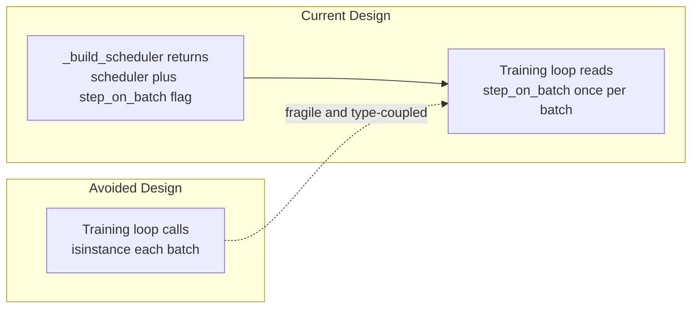

| # | Decision | Current Approach | Alternative | Why Current Wins |
| --- | --- | --- | --- | --- |
| 1 | Configuration | Frozen dataclasses | Dict or YAML config | Type safety; mutation prevention; IDE completion |
| 2 | Scheduler step timing | Boolean flag from factory | isinstance check in loop | New schedulers do not require editing loop logic |
| 3 | Data source | Synthetic Gaussian clusters | Real dataset download | Zero setup; deterministic; optimizer-focused |
| 4 | Model complexity | Simple two-layer MLP | ResNet or Transformer | Training dynamics visible; not dominated by architecture |
| 5 | AMP activation | Auto-disabled on CPU | Always enable and fail gracefully | Correct CPU behavior without requiring explicit flags |
| 6 | Artifact persistence | Post-run JSON and PNG | Live MLflow or W&B tracking | No external service; works fully offline |
| 7 | Experiment tracking | None; artifacts only | TensorBoard or Wandb | Zero dependency; usable in any environment |
| 8 | Default device | CPU with CUDA auto-detect | GPU-required | Runs on laptops; no driver setup required |

> [!NOTE]
> The project intentionally avoids experiment tracking services as a baseline constraint, not as a value judgment. MLflow, Weights and Biases, and TensorBoard are all reasonable additions depending on team workflow. The baseline is designed to be useful without any of them.

---

## Implementation Checklist

This checklist tracks the current state of the implementation against the intended feature set. Checked items are complete and tested. Unchecked items represent planned extensions that have been scoped but not yet implemented.

- [x] AdamW optimizer with configurable `lr` and `weight_decay`
- [x] CosineAnnealingLR with configurable `T_max` and `eta_min`
- [x] OneCycleLR with configurable `pct_start`, `div_factor`, `final_div_factor`
- [x] LinearLR with configurable `end_factor` and `total_iters`
- [x] No-scheduler baseline mode via `--scheduler none`
- [x] Optional AMP with automatic CPU detection and graceful disable
- [x] Deterministic seeding across Python, NumPy, and Torch RNGs
- [x] JSON history persistence with five metric arrays per epoch
- [x] PNG training curve output with loss and accuracy panels
- [x] Full CLI interface covering all configurable parameters
- [x] GitHub Actions CI workflow with end-to-end smoke run
- [x] Dependabot configuration for pip and GitHub Actions
- [x] Issue and PR templates
- [x] CONTRIBUTING.md and SECURITY.md community health files
- [x] Unit tests for `_build_scheduler` factory covering all four modes and error path
- [x] Unit tests for `validate()` numerical correctness
- [x] Model checkpointing to save weights at best validation loss (`--checkpoint-dir`)
- [ ] Benchmark notebook comparing all four schedulers on identical data and seed
- [ ] SGD with momentum baseline for direct AdamW comparison
- [ ] `ReduceLROnPlateau` scheduler mode
- [ ] `CosineAnnealingWarmRestarts` scheduler mode
- [ ] Gradient clipping via `--clip-grad-norm` flag

> [!IMPORTANT]
> Before implementing any unchecked item, run the smoke test to confirm the pipeline is intact: `python src/main.py --epochs 2 --n-samples 512 --batch-size 64 --no-amp`. Any change to `src/train.py` or `src/evaluate.py` should be immediately followed by `python -m pytest tests/ -v` to catch regressions.

---

*Project notes: All four scheduler modes were smoke-tested and confirmed end-to-end correct. PyTorch confirmed at 2.12.0+cu130. The synthetic dataset is designed so that optimizer and scheduler dynamics are the primary variable, not data complexity. Contributions welcome - see CONTRIBUTING.md for guidelines.*
