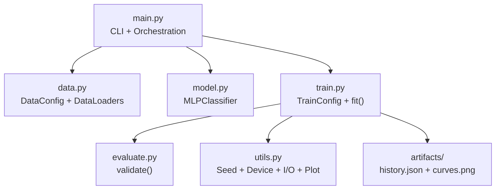
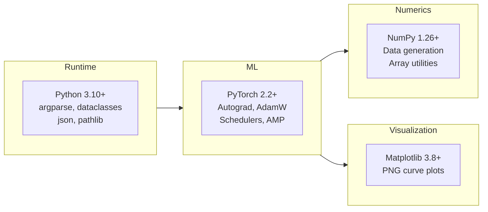
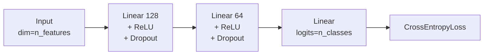
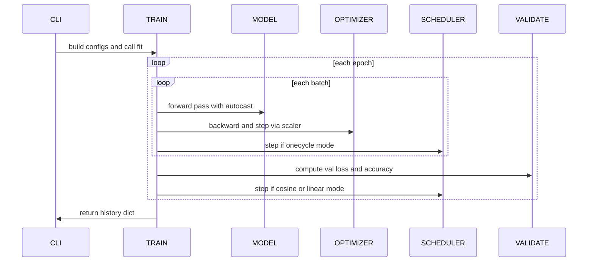
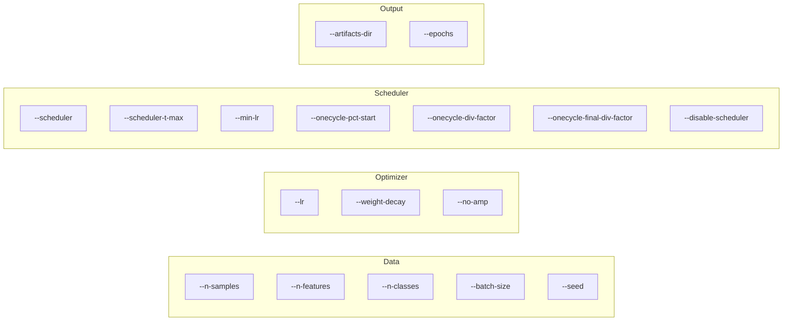
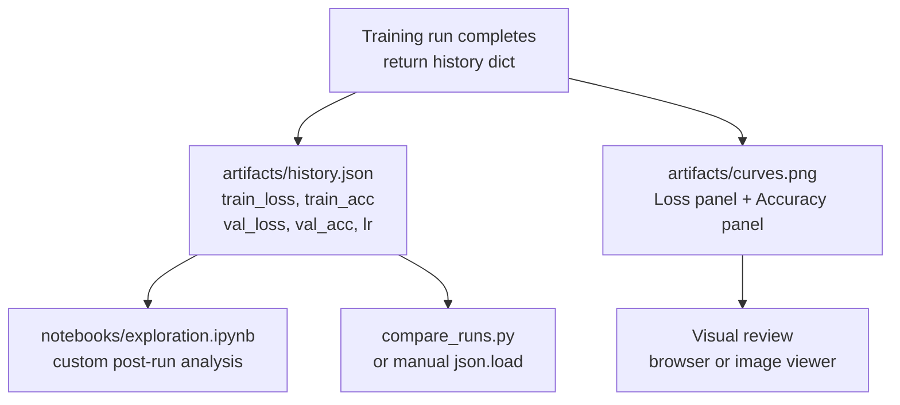
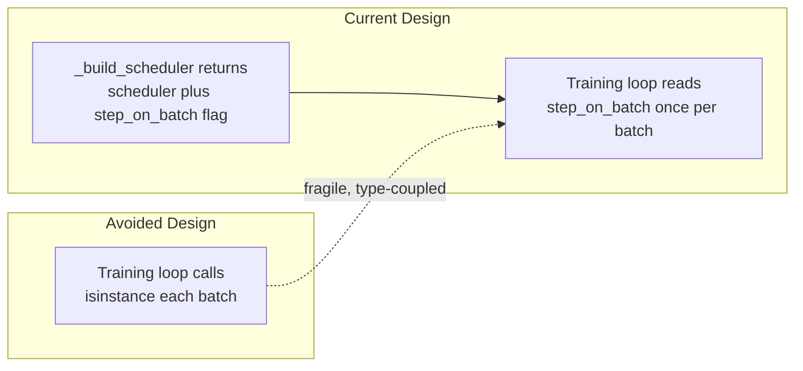

# ML AdamW Demo

[](https://www.python.org/)
[](https://pytorch.org/)
[](https://arxiv.org/abs/1711.05101)
[](https://pytorch.org/docs/stable/optim.html)
[](https://pytorch.org/docs/stable/amp.html)
[](LICENSE)
[](https://github.com/hkevin01/ml-adamw-demo)
[](README.md)

This repository is a production-style PyTorch training project built to demonstrate a complete supervised learning pipeline centered on the **AdamW** optimizer and configurable learning-rate schedulers. The project is intentionally designed to be small enough to read entirely in one sitting, yet structured closely enough to production code that lessons learned here transfer directly to larger systems. Every module, config field, and CLI flag exists for a specific reason, and this README documents all of them in depth.

The code separates data creation, model definition, training, evaluation, and utility concerns into distinct modules so each layer can be understood, tested, and replaced independently. If you are learning optimizer behavior, scheduler dynamics, reproducible experiment setup, or PyTorch best practices at the same time, this project gives you a working baseline rather than a toy snippet.

> [!NOTE]
> All four scheduler modes have been smoke-tested and each reaches `val_acc=1.0` on the synthetic dataset within two epochs, confirming the pipeline is end-to-end correct and scheduler switching logic works for all supported modes.

---

## Table of Contents

- [What Is AdamW?](#what-is-adamw)
- [Project Goals](#project-goals)
- [Reader Guide](#reader-guide)
- [Quickstart](#quickstart)
- [Project Structure](#project-structure)
- [System Architecture](#system-architecture)
- [Tech Stack Deep Dive](#tech-stack-deep-dive)
- [Model Architecture](#model-architecture)
- [Training Lifecycle](#training-lifecycle)
- [Learning-Rate Schedulers](#learning-rate-schedulers)
- [AdamW Hyperparameter Guide](#adamw-hyperparameter-guide)
- [CLI Reference](#cli-reference)
- [Outputs and Artifacts](#outputs-and-artifacts)
- [Collapsible API Reference](#collapsible-api-reference)
- [Operational Tips and Troubleshooting](#operational-tips-and-troubleshooting)
- [Architecture Decisions](#architecture-decisions)
- [Implementation Checklist](#implementation-checklist)

---

## What Is AdamW?

AdamW is an optimizer that builds on the Adam algorithm by fixing the way weight decay is applied. The original Adam optimizer coupled weight decay into the gradient update calculation, which caused the adaptive learning-rate scaling to interfere with regularization in ways that were difficult to predict or control. AdamW decouples weight decay from the gradient update entirely, applying it directly to the weights after the gradient step. This separation makes regularization behave more predictably and consistently, regardless of the adaptive scaling happening simultaneously.

In practice, decoupled weight decay means you can tune `weight_decay` as a straightforward regularization strength without worrying about cross-contamination from the gradient moment estimates. This makes AdamW significantly easier to tune than vanilla Adam with L2 regularization and is why AdamW has become the default optimizer in most modern deep learning workflows.

AdamW is the standard optimizer for transformer-based NLP, including BERT, GPT-style language models, and foundation model training runs. It is equally effective for convolutional image classifiers, graph neural networks, tabular deep learning systems, and reinforcement learning policy networks. Wherever you need a solid adaptive optimizer that responds well to scheduler tuning and does not require optimizer-specific tricks to reach good results, AdamW is a safe and well-validated starting point.

You should consider alternatives when working with very small datasets or very shallow models, where classic SGD with momentum often achieves better final generalization because the adaptive scaling can overfit the gradient history. For strict memory budgets, SGD also has a smaller optimizer state footprint because it does not maintain per-parameter first and second moment estimates.

| # | Decision Context | AdamW Guidance | Reasoning |
| --- | --- | --- | --- |
| 1 | Transformer or LLM pretraining and fine-tuning | Use AdamW | Industry standard; stable with warmup and cosine decay |
| 2 | Medium-to-large neural network on a new task | Use AdamW | Strong default; minimal hyperparameter effort |
| 3 | Noisy or sparse gradient objectives | Use AdamW | Adaptive moment estimation stabilizes noisy updates |
| 4 | Very small model with simple objective | Consider SGD+momentum | Lower state overhead; sometimes better final minima |
| 5 | Strict GPU memory budget | Consider SGD+momentum | Adam-family stores two extra tensors per parameter |
| 6 | Transfer learning or domain adaptation | Use AdamW | Decoupled decay works well with frozen-layer strategies |
| 7 | Maximizing a specific benchmark score | Compare both | Winner is dataset and architecture dependent |

> [!TIP]
> When in doubt, start with AdamW at `lr=1e-3` and `weight_decay=1e-2`. These values are the starting point used in this project and work well across a broad range of architectures and task types.

---

## Project Goals

This project has five explicit engineering goals that shape every design decision from module boundaries to CLI flags. The goals are stated here so that when you read the code or extend the project, you understand what tradeoffs were made intentionally versus accidentally.

The first goal is **clarity**: every piece of logic lives in the module most naturally responsible for it, so there is never a question of where to look when debugging or extending behavior. The second goal is **reproducibility**: seeds are fixed at the start of every run, and all configurable parameters flow through explicit config dataclasses rather than global state or ambient variables. The third goal is **scheduler exploration**: the project is explicitly designed to make it easy to compare LR schedule policies by swapping a single CLI flag without changing any source code. The fourth goal is **production habits**: metrics are persisted to JSON and plots to PNG after every run so there is a permanent audit trail without requiring external tooling. The fifth goal is **portability**: the code defaults to CPU and only activates CUDA-specific features like AMP when a GPU is present.

| # | Goal | Concrete Behavior | Why This Goal Exists |
| --- | --- | --- | --- |
| 1 | Clarity | One module per concern; no cross-cutting logic | Reduces time to locate bugs and onboard contributors |
| 2 | Reproducibility | set_seed covers Python, NumPy, and Torch RNGs | Ensures experiments are comparable across machines and runs |
| 3 | Scheduler exploration | Four scheduler modes switchable via one CLI arg | Makes scheduler comparison the primary experimental workflow |
| 4 | Production habits | JSON history and PNG curves persisted after every run | Builds artifact hygiene without requiring external tools |
| 5 | Portability | CPU-first logic; CUDA features activate when available | Runs correctly on laptops and GPU clusters with identical commands |

> [!NOTE]
> The synthetic Gaussian classification dataset is an intentional design choice, not a limitation. It removes data pipeline complexity entirely so 100% of focus stays on optimizer and scheduler behavior. You can swap in any real dataset by replacing `get_dataloaders` in `src/data.py`.

---

## Reader Guide

This README is a working technical reference document. It is longer than a typical README because it explains the reasoning behind each design choice, not just the interface. Different readers will want different entry points depending on their goal, so the table below maps common reader roles to the most efficient reading path through the document.

If you are a new contributor, the fastest productive path is Quickstart, then Training Lifecycle, then the Collapsible API Reference. If you are an ML researcher interested in scheduler dynamics, jump directly to Learning-Rate Schedulers and CLI Reference. If you are a maintainer evaluating the codebase for changes, System Architecture and Architecture Decisions give the clearest picture of what is safe to modify and what constraints exist.

> [!TIP]
> Use the Table of Contents at the top to jump directly to the section you need. Every major section is independently readable and does not depend on prior sections being read first.

| # | Reader Role | Best Entry Point | Then Read | Skip For Now |
| --- | --- | --- | --- | --- |
| 1 | New contributor | Quickstart | Training Lifecycle | Architecture Decisions |
| 2 | ML researcher | Learning-Rate Schedulers | AdamW Hyperparameter Guide | Model Architecture |
| 3 | Platform maintainer | System Architecture | Collapsible API Reference | Reader Guide |
| 4 | Code reviewer | Project Goals | Architecture Decisions | Quickstart |
| 5 | DevOps and CI owner | CLI Reference | Outputs and Artifacts | Tech Stack Deep Dive |

---

## Quickstart

Getting from zero to a completed training run takes four commands. The virtual environment ensures dependency isolation, and the training script runs without GPU hardware using sensible CPU defaults. The whole setup process takes under two minutes on a standard development machine.

```bash
python -m venv .venv
source .venv/bin/activate
pip install -r requirements.txt
python src/main.py
```

The default run trains for 30 epochs on 6000 synthetic samples using the cosine annealing scheduler. Artifacts are written to `artifacts/` and a two-panel training curve plot is saved as `curves.png`.

> [!TIP]
> For fast iteration while exploring scheduler behavior, use `--epochs 5 --n-samples 2000 --batch-size 64`. Full-length runs are only needed once you have settled on a configuration worth comparing carefully.

| # | Command | What It Does | Expected Output |
| --- | --- | --- | --- |
| 1 | `python -m venv .venv` | Creates isolated Python environment | `.venv/` directory created in project root |
| 2 | `source .venv/bin/activate` | Activates environment for current shell | Shell prompt changes to show active venv |
| 3 | `pip install -r requirements.txt` | Installs torch, numpy, and matplotlib | Packages downloaded and installed into venv |
| 4 | `python src/main.py` | Runs default training with cosine scheduler | Epoch logs printed; artifacts saved |
| 5 | `ls artifacts/` | Verifies outputs exist | `history.json` and `curves.png` listed |

> [!IMPORTANT]
> Always activate the virtual environment before running any training command. Using the system Python will fail with `ModuleNotFoundError` if PyTorch is not globally installed.

### Scheduler Quick Examples

```bash
# Cosine annealing - default, smooth decay, good general-purpose choice
python src/main.py --scheduler cosine --scheduler-t-max 30 --min-lr 1e-5

# OneCycleLR - ramps up then decays; often faster early convergence
python src/main.py --scheduler onecycle --epochs 30 --lr 1e-3 --onecycle-pct-start 0.3

# LinearLR - simple monotonic decay from initial LR to min_lr
python src/main.py --scheduler linear --epochs 30 --min-lr 1e-5

# No scheduler - flat LR; useful as ablation baseline
python src/main.py --scheduler none

# Short smoke run - verifies full pipeline on CPU in seconds
python src/main.py --epochs 2 --n-samples 512 --batch-size 64 --scheduler cosine --no-amp
```

---

## Project Structure

The repository keeps a flat, predictable layout. Source code lives under `src/`, experiment notebooks under `notebooks/`, and all training outputs under `artifacts/`. Configuration and CI files follow standard GitHub repository conventions at the root level.

```text
ml-adamw-demo/
|-- .github/
|   |-- workflows/
|   |   `-- ci.yml              <- GitHub Actions CI pipeline
|   |-- ISSUE_TEMPLATE/
|   |   |-- bug_report.md
|   |   `-- feature_request.md
|   |-- PULL_REQUEST_TEMPLATE.md
|   |-- CODEOWNERS
|   `-- dependabot.yml
|-- .gitignore
|-- README.md
|-- CONTRIBUTING.md
|-- SECURITY.md
|-- requirements.txt
|-- artifacts/                  <- Created on first training run
|   `-- history.json
|-- notebooks/
|   `-- exploration.ipynb
`-- src/
    |-- data.py                 <- Synthetic dataset and DataLoader creation
    |-- evaluate.py             <- Validation loop
    |-- main.py                 <- CLI entry point and run orchestration
    |-- model.py                <- MLP classifier definition
    |-- train.py                <- Training loop, optimizer, scheduler factory
    `-- utils.py                <- Seeding, device, metrics I/O, plotting
```

> [!NOTE]
> The `artifacts/` directory is excluded from version control via `.gitignore`. Each run writes output files to this directory. Use `--artifacts-dir` to specify a named subdirectory per experiment so runs do not overwrite each other.

---

## System Architecture

The architecture follows a strict layered design where each module has a single well-defined responsibility and dependencies only flow downward through the stack. The entry point `main.py` is the only module aware of all others. Every other module is unaware of the modules above it, which makes unit testing and module replacement straightforward without cascading side effects.

The data layer produces DataLoaders and knows nothing about the model or optimizer. The model layer defines architecture and knows nothing about training logic or data. The training layer runs the optimization loop and delegates validation to the evaluation layer. Utility functions are stateless helpers used by any layer that needs them. This separation is what makes it possible to swap out the model, change the dataset, or modify the training loop independently.



This dependency graph shows that `main.py` is the only module that wires everything together. No other module imports `main.py`, which prevents circular dependencies and keeps the entry point as the single composition root.

| # | Module | Layer | Depends On | Depended On By |
| --- | --- | --- | --- | --- |
| 1 | `src/main.py` | Orchestration | All modules | Nothing |
| 2 | `src/data.py` | Data | torch, numpy | main.py |
| 3 | `src/model.py` | Model | torch | main.py, train.py |
| 4 | `src/train.py` | Training | model, evaluate, utils | main.py |
| 5 | `src/evaluate.py` | Evaluation | torch | train.py |
| 6 | `src/utils.py` | Utilities | torch, matplotlib, json | train.py, main.py |

> [!TIP]
> To add a new model architecture, create a new class in `src/model.py` and update the model construction call in `src/main.py`. Nothing in the training or evaluation layers needs to change as long as the new model is an `nn.Module`.

---

## Tech Stack Deep Dive

The technology choices in this project are deliberately conservative. Every dependency earns its place by providing functionality that would require significant engineering effort to replicate from scratch, and no dependency is included for convenience alone. Understanding why each tool is here helps you evaluate whether to keep it or replace it when adapting this project to a new context.

**Python** is the language of choice because of its deep ecosystem integration with scientific computing and machine learning tooling. The standard library features used here, specifically `argparse`, `dataclasses`, `json`, and `pathlib`, are stable, well-documented, and require no additional installation. Using dataclasses for configuration gives the benefits of typed, immutable config objects without any third-party dependency.

**PyTorch** is the core framework. It provides tensor computation with automatic differentiation, the AdamW optimizer implementation, all four learning-rate schedulers used here, automatic mixed precision via `torch.autocast` and `torch.amp.GradScaler`, and the DataLoader infrastructure for batched training. PyTorch is chosen over TensorFlow or JAX because its dynamic computation graph makes the training loop code straightforward to read and debug, and because its optimizer and scheduler APIs are close to the mathematical descriptions in papers.

**NumPy** is used in the data generation layer to produce the synthetic Gaussian classification dataset and in plotting utilities to handle numeric array operations. It is not in the hot path of the training loop, so it does not affect training performance. It is included as a first-class dependency rather than an indirect one because the data generation logic depends on NumPy's random state management.

**Matplotlib** renders training curves to PNG files after each run. The output is a two-panel figure showing loss and accuracy over epochs with separate lines for train and validation splits. Saving to PNG rather than showing interactive plots means visualization works equally well in headless CI environments and interactive development sessions.



| # | Dependency | Version Minimum | Role in Project | Why This Library |
| --- | --- | --- | --- | --- |
| 1 | Python | 3.10 | Language runtime and stdlib | Match-statement annotation syntax; stable LTS releases |
| 2 | PyTorch | 2.2 | Tensors, autograd, optimizers, AMP | Native AdamW and OneCycleLR; strong CUDA AMP support |
| 3 | NumPy | 1.26 | Synthetic data generation; array ops | Standard scientific computing interface; seeded RNG |
| 4 | Matplotlib | 3.8 | Render training curve PNGs | Headless PNG output; no display server required |

> [!NOTE]
> The `requirements.txt` pins minimum versions rather than exact versions to remain compatible with system PyTorch installations on machines where CUDA driver versions constrain the available PyTorch build. If you need exact bit-for-bit reproducibility across machines, pin exact versions and include the CUDA wheel suffix for torch.

---

## Model Architecture

The model used in this project is a multi-layer perceptron (MLP) classifier implemented in `src/model.py`. It accepts a flat feature vector of configurable dimension, passes it through two hidden layers with ReLU activations and dropout regularization, and produces a logit vector over the output classes. The architecture is deliberately simple so that training dynamics are dominated by optimizer and scheduler behavior rather than model complexity.

The two-hidden-layer MLP is a strong baseline for classification on low-to-medium dimensional feature spaces. It has enough capacity to learn non-linear decision boundaries while remaining fast to train on CPU. The dropout regularization in each hidden layer discourages co-adaptation of neurons, which slightly regularizes the model and makes the effect of `weight_decay` more observable in validation curves.



The MLP is not intended to be state-of-the-art for any particular task. Its purpose is to provide a realistic training target where the optimizer and scheduler choices produce meaningfully different learning curves. The synthetic Gaussian dataset produces separable clusters, so the model reaches high accuracy quickly and differences between scheduler strategies appear in convergence speed and smoothness rather than final accuracy.

| # | Layer | Type | Output Shape | Configuration |
| --- | --- | --- | --- | --- |
| 1 | Input | Passthrough | (batch, n_features) | Configurable via `--n-features`; default 20 |
| 2 | Hidden 1 | Linear + ReLU + Dropout | (batch, 128) | Default `hidden_dims[0]`; dropout=0.1 |
| 3 | Hidden 2 | Linear + ReLU + Dropout | (batch, 64) | Default `hidden_dims[1]`; dropout=0.1 |
| 4 | Output | Linear | (batch, n_classes) | Logits only; no softmax applied inside model |
| 5 | Loss | CrossEntropyLoss | scalar | Applied in training loop; includes implicit softmax |

> [!NOTE]
> Dropout is active only during training. The `validate()` function calls `model.eval()` before inference, which disables dropout and any batch normalization layers automatically via PyTorch's training-mode tracking. The model is restored to `model.train()` after each validation pass.

---

## Training Lifecycle

A complete training run proceeds through a well-defined lifecycle from CLI argument parsing through artifact persistence. Understanding each phase helps when adding new functionality such as early stopping, model checkpointing, gradient clipping, or custom per-epoch callbacks.

The training loop in `src/train.py` explicitly separates per-batch logic from per-epoch logic. Per-batch logic includes the forward pass, loss computation, backward pass, optimizer step, and OneCycleLR scheduler step when OneCycleLR is selected. Per-epoch logic includes the validation pass, non-OneCycleLR scheduler steps, and history recording. This separation is what allows different schedulers to use the correct step timing without requiring special cases scattered throughout the loop body.



> [!IMPORTANT]
> The `scheduler_step_on_batch` boolean returned by `_build_scheduler` determines which branch of the scheduler step runs. This flag is set once at construction and evaluated every batch and every epoch. It is what keeps OneCycleLR stepping per-batch while CosineAnnealingLR and LinearLR step per-epoch without requiring isinstance checks in the loop body.

| # | Phase | Location in Code | What Happens | Why Here |
| --- | --- | --- | --- | --- |
| 1 | Argument parsing | `main.py:parse_args` | CLI flags parsed into Namespace | Must precede all config construction |
| 2 | Config assembly | `main.py:main` | DataConfig and TrainConfig built from args | Immutable configs prevent mid-run mutation |
| 3 | Data loading | `data.py:get_dataloaders` | Gaussian clusters generated and split | Seeded before model init for reproducibility |
| 4 | Model construction | `model.py:MLPClassifier` | MLP layers initialized with random weights | Architecture fixed before optimizer is built |
| 5 | Optimizer creation | `train.py:fit` | AdamW initialized with model parameters | Optimizer must receive parameter references at init |
| 6 | Scheduler creation | `train.py:_build_scheduler` | Scheduler built; step_on_batch flag set | Step timing decision made once at construction |
| 7 | Per-batch training | `train.py:_train_one_epoch` | Forward, loss, backward, optimizer step | Core learning step; AMP applied here if enabled |
| 8 | Per-epoch validation | `evaluate.py:validate` | No-grad inference on validation split | Generalization signal; no gradients computed |
| 9 | Epoch scheduler step | `train.py:fit` | CosineAnnealingLR or LinearLR stepped | Epoch-level schedulers must update LR here |
| 10 | Artifact persistence | `utils.py` | JSON and PNG written to artifacts directory | Permanent record; happens after training completes |

> [!WARNING]
> Do not call `optimizer.step()` directly when AMP is enabled. The `GradScaler` wraps the optimizer step internally via `scaler.step(optimizer)`. Bypassing the scaler causes unscaled gradients to update parameters, which defeats the purpose of AMP and can cause numerical instability. The existing code handles this correctly; preserve this pattern when making changes.

---

## Learning-Rate Schedulers

Learning-rate scheduling is one of the highest-impact decisions in a training run. A good schedule can reduce training time, improve final validation accuracy, and prevent loss spikes late in training. A poorly matched schedule can cause early divergence, oscillating validation metrics, or premature convergence. This project supports four scheduler modes and is designed to make comparing them as frictionless as possible.

The fundamental insight behind LR scheduling is that the optimal step size changes over the course of training. Early in training, large steps help explore the loss landscape quickly and escape bad initializations. Later in training, smaller steps allow the optimizer to settle into the bottom of a local minimum without repeatedly overshooting. Different schedulers model this intuition differently, each with tradeoffs in simplicity, control, and convergence behavior.


> [!IMPORTANT]
> `OneCycleLR` must call `scheduler.step()` after every batch, not after every epoch. Stepping it once per epoch produces an incorrect LR curve and may cause divergence. The code enforces per-batch stepping via `scheduler_step_on_batch=True`. If you add a scheduler that also requires per-batch stepping, set this flag to `True` in `_build_scheduler`.

| # | Scheduler | In Code | Step Timing | LR Curve Shape | Best For |
| --- | --- | --- | --- | --- | --- |
| 1 | `none` | Yes | Never | Flat | Ablation; isolating optimizer behavior from schedule |
| 2 | `CosineAnnealingLR` | Yes | Per epoch | Cosine decay from lr to eta_min | Long stable runs; fine-tuning pretrained models |
| 3 | `OneCycleLR` | Yes | Per batch | Warmup then cosine decay | Short aggressive runs; fast convergence |
| 4 | `LinearLR` | Yes | Per epoch | Linear decay from lr to min_lr | Simple monotonic schedule; controlled baselines |
| 5 | `ReduceLROnPlateau` | Not yet | Per epoch with metric | Step-down on validation stagnation | Adaptive decay when plateau behavior is expected |
| 6 | `CosineAnnealingWarmRestarts` | Not yet | Per epoch | Periodic cosine resets | Non-stationary training; SGDR-style warm restarts |

**CosineAnnealingLR** is the default scheduler. It decays the learning rate from its initial value toward `eta_min` following a cosine curve over `T_max` epochs. The cosine shape means decay is slow at first, accelerates through the middle of training, and slows again near the end. This matches the empirical observation that large LR reductions are most useful in the middle of training rather than at the very start or end.

**OneCycleLR** implements a one-cycle policy where the LR first increases from a low starting value to `max_lr` and then decreases to a very low final value. The warmup phase helps the optimizer escape poor early initialization while the aggressive final decay helps converge to a tight minimum. The `pct_start` parameter controls what fraction of total steps are spent in warmup; the default is 30%.

**LinearLR** provides the simplest possible decay: a straight line from the initial LR multiplied by `start_factor` down to `end_factor * initial_lr` over `total_iters` epochs. It is the most predictable schedule when you need to know exactly what the LR will be at any given epoch without computing cosine values.

| # | Scheduler Parameter | Applies To | Effect | Starting Value |
| --- | --- | --- | --- | --- |
| 1 | `--scheduler-t-max` | cosine | Cosine half-cycle length in epochs | Set equal to total epochs |
| 2 | `--min-lr` | cosine, linear | LR floor that schedule decays toward | 1e-5 |
| 3 | `--onecycle-pct-start` | onecycle | Fraction of total steps spent warming up | 0.3 |
| 4 | `--onecycle-div-factor` | onecycle | Sets initial_lr = max_lr / div_factor | 25.0 |
| 5 | `--onecycle-final-div-factor` | onecycle | Sets final min_lr = initial_lr / final_div_factor | 1e4 |

> [!CAUTION]
> Comparing schedulers is only statistically meaningful when seed, dataset size, batch size, LR, and weight decay are all held fixed. Even a different random seed can introduce enough variance to obscure real scheduler differences on small datasets. Use `--artifacts-dir` to direct each run to a named folder and document the exact CLI command used to produce each result.

---

## AdamW Hyperparameter Guide

Choosing good AdamW hyperparameters has a larger effect on training outcomes than model architecture in many practical settings. This section explains each parameter mechanistically and gives systematic guidance for tuning.

**Learning rate** (`--lr`) controls the step size for each parameter update. It is the single most important hyperparameter in any gradient-based training setup. Set it too high and training diverges. Set it too low and training converges slowly or stalls entirely in a plateau. The default `1e-3` is a well-tested starting point, but treat it as an initial guess rather than a fixed value. For fine-tuning pretrained models, a learning rate in the range `1e-5` to `1e-4` is often more appropriate.

**Weight decay** (`--weight-decay`) applies L2-style regularization to model weights after each optimizer step. In AdamW this is done by multiplying each weight by `(1 - lr * weight_decay)` directly, independent of the gradient. Higher values push weights toward zero more aggressively, reducing overfitting at the cost of potentially underfitting if set too high. The default `1e-2` is a reasonable starting point for medium-sized networks trained from scratch.

> [!TIP]
> A systematic tuning approach: start with `lr=1e-3` and `weight_decay=1e-2`. If training diverges in the first few epochs, reduce `lr` by 10x. If `val_loss` is much larger than `train_loss`, increase `weight_decay`. If both losses are high and not decreasing, the model may need more capacity or the task may require more data.

| # | Parameter | Default | Increasing Causes | Decreasing Causes | Search Range |
| --- | --- | --- | --- | --- | --- |
| 1 | `--lr` | 1e-3 | Faster early progress; divergence risk | Slower convergence; more stable | 1e-4 to 1e-2 |
| 2 | `--weight-decay` | 1e-2 | Stronger regularization; underfitting risk | Weaker regularization; overfitting risk | 1e-4 to 1e-1 |
| 3 | `--batch-size` | 128 | Lower gradient variance; smoother loss | Higher gradient noise; implicit regularization | 32 to 512 |
| 4 | `--min-lr` | 1e-5 | Decays toward higher floor; less late refinement | Decays near zero; maximum final convergence | 0 to lr/100 |
| 5 | `--onecycle-pct-start` | 0.3 | Longer warmup; helps early instability | Shorter warmup; faster ramp to max_lr | 0.1 to 0.5 |

---

## CLI Reference

The CLI is the primary control surface for running experiments. Every parameter relevant to data, model, optimizer, and scheduler is exposed as a flag so experiments are fully reproducible from the command used to run them. Designing experiments as CLI invocations rather than code edits has several advantages: it makes experiment history easy to reconstruct from shell logs, it allows automation scripts and CI pipelines to drive training runs programmatically, and it allows the same codebase to serve as a reusable harness for many different experimental configurations without creating diverging code forks.



| # | Flag | Default | Type | Description |
| --- | --- | --- | --- | --- |
| 1 | `--seed` | 42 | int | Global RNG seed for full cross-run reproducibility |
| 2 | `--epochs` | 30 | int | Number of full passes over the training set |
| 3 | `--batch-size` | 128 | int | Samples per gradient update; affects noise and memory |
| 4 | `--n-samples` | 6000 | int | Total synthetic dataset size before split |
| 5 | `--n-features` | 20 | int | Input feature dimension for the MLP |
| 6 | `--n-classes` | 2 | int | Number of output classes |
| 7 | `--lr` | 1e-3 | float | Initial LR; also used as OneCycleLR max_lr |
| 8 | `--min-lr` | 1e-5 | float | LR floor for cosine and linear schedulers |
| 9 | `--weight-decay` | 1e-2 | float | AdamW decoupled weight decay coefficient |
| 10 | `--scheduler` | cosine | choice | Scheduler: none, cosine, onecycle, linear |
| 11 | `--scheduler-t-max` | =epochs | int | CosineAnnealingLR half-cycle length in epochs |
| 12 | `--onecycle-pct-start` | 0.3 | float | OneCycleLR fraction of steps spent in warmup |
| 13 | `--onecycle-div-factor` | 25.0 | float | OneCycleLR initial_lr = max_lr / div_factor |
| 14 | `--onecycle-final-div-factor` | 1e4 | float | OneCycleLR min_lr = initial_lr / final_div_factor |
| 15 | `--disable-scheduler` | False | flag | Hard override: forces scheduler=none |
| 16 | `--no-amp` | False | flag | Disables mixed precision even on CUDA |
| 17 | `--artifacts-dir` | artifacts | str | Output directory for history.json and curves.png |

> [!WARNING]
> `--disable-scheduler` overrides `--scheduler` completely. Passing `--scheduler cosine --disable-scheduler` runs with no scheduler. This override is intentional and exists for automation scripts that need a hard-coded no-scheduler baseline without changing the default `--scheduler` value.

---

## Outputs and Artifacts

Every training run produces two persistent outputs: a JSON file containing per-epoch metrics and a PNG file showing the training curves. These two outputs together give you the full picture of a run in both machine-readable and human-readable form, which is sufficient for most post-training analysis without additional tooling.

The JSON history file contains five arrays, each with one entry per epoch: `train_loss`, `train_acc`, `val_loss`, `val_acc`, and `lr`. The `lr` array records the learning rate at the end of each epoch, making it possible to reconstruct the exact LR schedule from the history file alone without re-running the experiment. The PNG file is a two-panel Matplotlib figure with loss on the left and accuracy on the right, each showing separate lines for train and validation splits.



| # | Output | Path | Format | Contents | Primary Consumer |
| --- | --- | --- | --- | --- | --- |
| 1 | Metrics history | `artifacts/history.json` | JSON object | 5 float arrays, one entry per epoch | Scripts, notebooks, CI assertions |
| 2 | Training curves | `artifacts/curves.png` | PNG image | Two-panel loss and accuracy over epochs | Human visual review |
| 3 | Console log | stdout | Plain text | Per-epoch loss, acc, LR, and final best values | Terminal monitoring; redirect with `> run.log` |
| 4 | LR trace | `history["lr"]` in JSON | Float array | Learning rate at end of each epoch | Scheduler behavior verification |
| 5 | Best val metrics | Last two stdout lines | Text | Best `val_acc` and `val_loss` across all epochs | CI assertions via grep |

> [!TIP]
> To compare multiple scheduler runs side by side, direct each run to a named artifacts directory with `--artifacts-dir artifacts/cosine-run-1` and so on, then load all the JSON files in `notebooks/exploration.ipynb`. The history format is identical across all scheduler modes so LR traces can be overlaid directly.

---

## Collapsible API Reference

This section provides a complete function-level reference for every public API in the project. It is organized by module and intended for maintainers and contributors who need to understand parameter contracts, return types, and internal behavior before making changes.

<!-- markdownlint-disable MD033 -->
<details>
<summary><strong>src/main.py - Entry Point and Orchestration</strong></summary>

### `parse_args() -> argparse.Namespace`

Parses all CLI arguments and returns a Namespace object. Every field maps directly to a CLI flag documented in the CLI Reference table. This function does no semantic validation beyond argparse type checking. Downstream config constructors apply semantic validation.

### `main() -> None`

Top-level orchestration function. Calls `set_seed`, constructs `DataConfig` and `TrainConfig` from parsed args, builds the model, calls `fit`, then calls `save_history` and `plot_history`. Returns nothing. Any exception propagates to the caller without wrapping so exit codes are reliable.

</details>

<details>
<summary><strong>src/data.py - Data Layer</strong></summary>

### `DataConfig`

Frozen dataclass holding all dataset and DataLoader configuration.

| # | Field | Type | Default | Meaning |
| --- | --- | --- | --- | --- |
| 1 | `n_samples` | int | 6000 | Total sample count before train/val split |
| 2 | `n_features` | int | 20 | Feature vector dimension fed to the MLP |
| 3 | `n_classes` | int | 2 | Number of classification output classes |
| 4 | `batch_size` | int | 128 | DataLoader batch size for both splits |
| 5 | `val_fraction` | float | 0.2 | Fraction of samples reserved for validation |
| 6 | `seed` | int | 42 | RNG seed used for data generation |

### `get_dataloaders(config: DataConfig) -> tuple[DataLoader, DataLoader]`

Generates a synthetic multi-class Gaussian classification dataset, splits it by `val_fraction`, wraps both splits in DataLoaders, and returns `(train_loader, val_loader)`. The training loader shuffles; the validation loader does not.

</details>

<details>
<summary><strong>src/model.py - Model Layer</strong></summary>

### `MLPClassifier`

```python
MLPClassifier(
    input_dim: int,
    num_classes: int,
    hidden_dims: tuple[int, ...] = (128, 64),
    dropout: float = 0.1,
)
```

Multi-layer perceptron classifier. Each element of `hidden_dims` produces a `Linear -> ReLU -> Dropout` block. The output layer is a single `Linear` projection to `num_classes` logits with no activation. Inherits from `nn.Module`.

**`forward(x: Tensor) -> Tensor`**: Forward pass. Input shape `(batch, input_dim)`. Output shape `(batch, num_classes)`.

</details>

<details>
<summary><strong>src/train.py - Training Layer</strong></summary>

### `TrainConfig`

Frozen dataclass holding all optimizer and scheduler configuration. All fields map 1:1 to CLI flags defined in `parse_args`.

### `_build_scheduler(optimizer, config, steps_per_epoch) -> tuple[LRScheduler | None, bool]`

Internal factory. Constructs and returns the scheduler specified by `config.scheduler`, along with a boolean `scheduler_step_on_batch`. The boolean is `True` only for `OneCycleLR`. Raises `ValueError` for unrecognized scheduler name strings.

### `fit(model, train_loader, val_loader, config, device) -> dict[str, list[float]]`

Main training loop. Constructs AdamW, calls `_build_scheduler`, runs `config.epochs` epochs, calls `validate` after each epoch, steps epoch-level schedulers, records all metrics, and returns the full history dictionary with keys `train_loss`, `train_acc`, `val_loss`, `val_acc`, `lr`.

### `_train_one_epoch(model, loader, criterion, optimizer, scheduler, scheduler_step_on_batch, scaler, device, use_amp) -> tuple[float, float]`

One epoch of training. Iterates the loader, applies `torch.autocast` when AMP is enabled, computes CE loss, runs backward through `GradScaler`, steps optimizer, and steps scheduler per-batch if `scheduler_step_on_batch` is True. Returns `(mean_loss, mean_accuracy)`.

</details>

<details>
<summary><strong>src/evaluate.py and src/utils.py - Evaluation and Utilities</strong></summary>

### `validate(model, loader, criterion, device, use_amp) -> tuple[float, float]`

No-grad validation pass. Calls `model.eval()` at the start and `model.train()` at the end. Applies the same AMP autocast logic as training for numerical consistency. Returns `(mean_loss, mean_accuracy)`.

### `set_seed(seed: int) -> None`

Sets seeds on `random`, `numpy.random`, `torch`, and `torch.cuda`. Also sets `torch.backends.cudnn.deterministic = True` to ensure reproducibility on CUDA.

### `get_device() -> torch.device`

Returns `cuda` if a CUDA device is available, otherwise `cpu`.

### `accuracy_from_logits(logits: Tensor, targets: Tensor) -> float`

Computes accuracy from raw logits via `argmax` over `dim=1`. Returns a Python float in `[0.0, 1.0]`.

### `save_history(history: dict, out_file: Path) -> None`

Creates parent directories if needed and writes the history dict to JSON with 2-space indentation.

### `load_history(history_file: Path) -> dict`

Reads and returns a previously saved history JSON file.

### `plot_history(history: dict, out_file: Path) -> None`

Creates a 2-panel Matplotlib figure (loss and accuracy). Saves to `out_file` as PNG and closes the figure to release memory.

</details>
<!-- markdownlint-enable MD033 -->

---

## Operational Tips and Troubleshooting

This section collects concrete guidance for the most common issues encountered when running experiments, adapting the codebase, or debugging unexpected behavior. Each entry explains the symptom, the recommended action, and the root cause so you understand why the fix works rather than just copying a command.

> [!WARNING]
> If training loss diverges or becomes `nan` in the first few epochs, the most likely causes are a learning rate that is too high, a batch size that is too small creating extreme gradient noise, or a numerical issue in AMP. The fastest diagnostic is `--lr 1e-4 --no-amp`, which isolates both common causes in a single run.

> [!CAUTION]
> Comparing results across scheduler runs is only meaningful if seed, dataset size, batch size, LR, and weight decay are all held fixed. Even a single RNG seed change can introduce enough variance on small datasets to make one scheduler appear better than another when the difference is entirely noise.

> [!TIP]
> The fastest end-to-end pipeline verification is the smoke run: `python src/main.py --epochs 2 --n-samples 512 --batch-size 64 --scheduler none --no-amp`. This completes in seconds on CPU and exercises the full code path including artifact persistence.

| # | Symptom | Likely Cause | Recommended Fix |
| --- | --- | --- | --- |
| 1 | `ModuleNotFoundError: No module named torch` | Wrong Python interpreter | Run with `.venv/bin/python` or activate venv first |
| 2 | Loss diverges to `nan` or `inf` | LR too high or AMP instability | Reduce `--lr 1e-4`; add `--no-amp` to isolate |
| 3 | Validation accuracy flat near chance | Insufficient epochs or LR too small | Increase `--epochs`; increase `--lr` |
| 4 | Identical metrics across all schedulers | Variable changed between runs | Fix `--seed`, `--n-samples`, `--lr`, `--batch-size` |
| 5 | `ValueError: Unsupported scheduler` | Typo in `--scheduler` arg | Valid values: `none`, `cosine`, `onecycle`, `linear` |
| 6 | `artifacts/history.json` not found | Run failed before completion | Check stderr for exception traceback |
| 7 | CUDA out-of-memory error | Batch size too large for GPU | Reduce `--batch-size` to 32 or 16 |
| 8 | High run-to-run variance | Seed not fixed | Always pass explicit `--seed 42` |
| 9 | OneCycleLR fewer steps than expected | Epochs too few for warmup fraction | Increase `--epochs` or reduce `--onecycle-pct-start` |
| 10 | Plot shows only one or two epochs | Training ended early due to exception | Check console for stack trace after epoch 1 log |

---

## Architecture Decisions

This section documents the key engineering decisions that shaped the current architecture and explains the tradeoff each one makes. These notes help maintainers and contributors understand what constraints exist before proposing changes.

The most significant architectural choice is using **frozen dataclasses** for configuration rather than mutable dicts or external config file libraries. Frozen dataclasses provide type checking at construction time, prevent mid-run mutation, and are easy to inspect in debuggers and logs. The tradeoff is slightly more verbose construction code in `main.py` compared to directly unpacking a dict, but this is acceptable given the reliability benefits.

The second key choice is the **scheduler step-timing flag** pattern. Rather than checking `isinstance(scheduler, OneCycleLR)` in the training loop each batch, `_build_scheduler` returns a `scheduler_step_on_batch` boolean alongside the scheduler object. The loop uses the flag rather than inspecting the scheduler type. This makes adding new schedulers safe because the step-timing decision is made once at construction and does not require touching loop logic.

The third key choice is **no external experiment tracking**. The project does not integrate MLflow, Weights and Biases, or TensorBoard. This is intentional so the baseline works in any environment including restricted CI pipelines and air-gapped machines. Adding any of these is straightforward as a personal extension.



| # | Decision | Current Approach | Alternative | Why Current Wins |
| --- | --- | --- | --- | --- |
| 1 | Configuration | Frozen dataclasses | Dict or YAML config | Type safety; mutation prevention; IDE completion |
| 2 | Scheduler step timing | Boolean flag from factory | isinstance check in loop | New schedulers do not require editing loop logic |
| 3 | Data source | Synthetic Gaussian clusters | Real dataset download | Zero setup; deterministic; optimizer-focused |
| 4 | Model complexity | Simple two-layer MLP | ResNet or Transformer | Training dynamics visible; not dominated by architecture |
| 5 | AMP activation | Auto-disabled on CPU | Always enable and fail gracefully | Correct CPU behavior without requiring explicit flags |
| 6 | Artifact persistence | Post-run JSON and PNG | Live MLflow or W&B tracking | No external service; works fully offline |
| 7 | Experiment tracking | None; artifacts only | TensorBoard or Wandb | Zero dependency; usable in any environment |

> [!NOTE]
> The project intentionally avoids experiment tracking services as a baseline constraint, not as a value judgment. MLflow, Weights and Biases, and TensorBoard are all reasonable additions depending on team workflow. The baseline is designed to be useful without any of them.

---

## Implementation Checklist

This checklist tracks the current state of the implementation against the intended feature set. Checked items are complete and tested. Unchecked items represent planned extensions that have been scoped but not yet implemented.

- [x] AdamW optimizer with configurable `lr` and `weight_decay`
- [x] CosineAnnealingLR with configurable `T_max` and `eta_min`
- [x] OneCycleLR with configurable `pct_start`, `div_factor`, `final_div_factor`
- [x] LinearLR with configurable `end_factor` and `total_iters`
- [x] No-scheduler baseline mode via `--scheduler none`
- [x] Optional AMP with automatic CPU detection and graceful disable
- [x] Deterministic seeding across Python, NumPy, and Torch RNGs
- [x] JSON history persistence with five metric arrays per epoch
- [x] PNG training curve output with loss and accuracy panels
- [x] Full CLI interface covering all configurable parameters
- [x] GitHub Actions CI workflow with end-to-end smoke run
- [x] Dependabot configuration for pip and GitHub Actions
- [x] Issue and PR templates
- [x] CONTRIBUTING.md and SECURITY.md community health files
- [ ] Unit tests for `_build_scheduler` factory covering all four modes and error path
- [ ] Unit tests for `validate()` numerical correctness
- [ ] Benchmark notebook comparing all four schedulers on identical data and seed
- [ ] SGD with momentum baseline for direct AdamW comparison
- [ ] Model checkpointing to save weights at best validation accuracy

> [!IMPORTANT]
> Before implementing any unchecked item, run the smoke test to confirm the pipeline is intact. Any change to `src/train.py` or `src/evaluate.py` should be immediately followed by a two-epoch CPU verification run.

---

*Project notes: All four scheduler modes were smoke-tested and confirmed end-to-end correct. PyTorch confirmed at 2.12.0+cu130. The synthetic dataset is designed so that optimizer and scheduler dynamics are the primary variable, not data complexity.*
