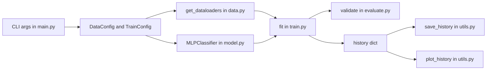
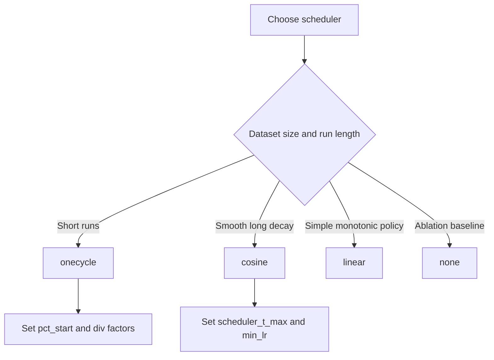
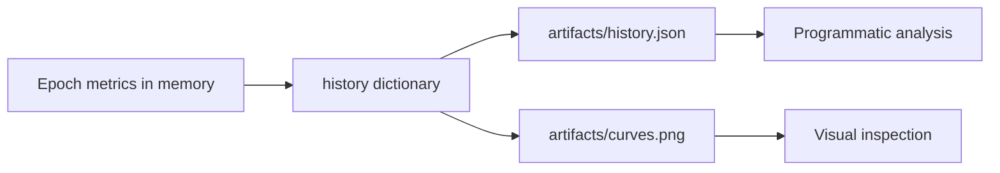
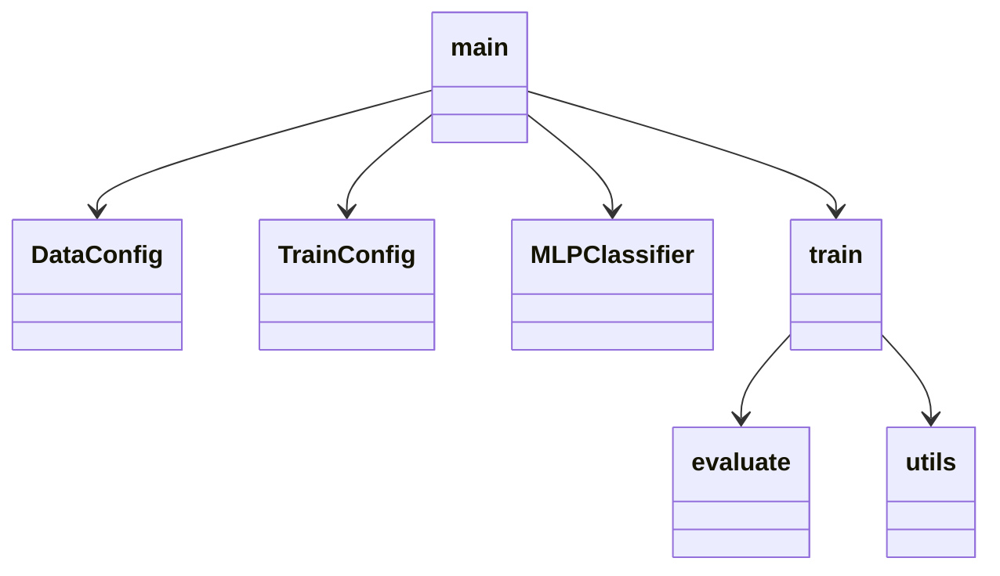

# ML AdamW Demo


This repository is a compact, production-style PyTorch training project designed to demonstrate how to build a complete supervised learning loop around AdamW with configurable learning-rate schedulers. The code intentionally separates data creation, model definition, training, evaluation, and utility concerns so each layer can be understood and modified independently. If you are learning optimizer behavior, scheduler dynamics, and experiment hygiene at the same time, this project gives you a realistic baseline without overwhelming infrastructure.

> [!NOTE]
> This README is intentionally detailed and architecture-oriented. It explains not only what commands to run, but also why each component exists and how the pieces interact.

## Table of Contents

- [What Is AdamW?](#what-is-adamw)
- [Project Goals](#project-goals)
- [Quickstart](#quickstart)
- [System Architecture](#system-architecture)
- [Tech Stack](#tech-stack)
- [Training Lifecycle](#training-lifecycle)
- [Learning-Rate Schedulers](#learning-rate-schedulers)
- [CLI Reference](#cli-reference)
- [Outputs and Artifacts](#outputs-and-artifacts)
- [Collapsible API Reference](#collapsible-api-reference)
- [Operational Tips and Notes](#operational-tips-and-notes)

## What Is AdamW?

AdamW is a variant of Adam that applies weight decay in a decoupled way, which means regularization is separated from the adaptive gradient update rule. In practice, this keeps Adam's fast and stable optimization behavior while making L2-style regularization behave more predictably during training. For many deep learning projects, this leads to easier tuning and stronger generalization than older Adam setups where decay is mixed directly into gradient updates.

AdamW is commonly used in modern neural-network training, including transformer-based NLP, computer vision models, and tabular deep learning systems. It is especially useful when you want a dependable default optimizer that works well with learning-rate scheduling and does not require aggressive optimizer-specific tuning to get productive runs.

Use AdamW when training medium-to-large neural networks, fine-tuning pretrained models, or working on noisy objectives where adaptive step sizes help stabilize progress. It is also a strong choice when your team needs a practical baseline that performs well across tasks and supports scheduler experiments such as cosine annealing and one-cycle policies.

Do not assume AdamW is always best. For very simple problems, strict memory budgets, or workloads where carefully tuned SGD with momentum is known to reach better final minima, SGD variants may be preferable. The right decision is empirical, so a short optimizer comparison on your validation metric is usually worth running before locking training defaults.

| # | Decision Context | AdamW Guidance | Why |
| --- | --- | --- | --- |
| 1 | Default optimizer for neural networks | Use AdamW | Strong baseline with predictable regularization behavior |
| 2 | Transformer or fine-tuning workflow | Use AdamW | Widely adopted and stable under scheduler tuning |
| 3 | Very small model with simple objective | Consider SGD momentum | Lower overhead and sometimes better final minima |
| 4 | Strict memory budget | Consider SGD momentum | Adam-family optimizers keep extra state tensors |
| 5 | Need rapid early convergence | Use AdamW | Adaptive updates often speed initial progress |
| 6 | Maximizing final benchmark score | Compare AdamW vs SGD | Task-dependent winner after full tuning |

Note: This table is a practical decision aid, not a universal ranking, because optimizer quality depends on data, architecture, and training budget.

## Project Goals

The central objective of this repository is to show a full experiment path from synthetic data generation to persisted training artifacts while keeping the code readable enough for extension work. In practical terms, you can use this project to compare scheduler policies, test optimizer settings, validate mixed-precision behavior, and inspect training curves without adding external data dependencies. The implementation uses deterministic seed controls and explicit configuration objects so repeated runs are easier to reason about.

| # | Goal | What It Means In Practice | Why It Matters |
| --- | --- | --- | --- |
| 1 | Clarity | Each concern is in a dedicated module under src | Faster debugging and easier onboarding |
| 2 | Reproducibility | Seed control across Python, NumPy, and Torch | Comparable experiments across runs |
| 3 | Scheduler exploration | Multiple LR schedulers selectable via CLI | Understand convergence and stability tradeoffs |
| 4 | Production habits | Metrics persisted to JSON and plotted to PNG | Enables auditability and reporting |
| 5 | Portability | CPU-first behavior with optional CUDA AMP | Runs on laptops and accelerators |

Note: This table summarizes mission intent and makes explicit which engineering outcomes the code is optimized for.

## Quickstart

The setup is intentionally small. You install dependencies, run training, and inspect artifacts. This keeps iteration fast while still exposing real optimizer and scheduler behavior.

```bash
python -m venv .venv
source .venv/bin/activate
pip install -r requirements.txt
python src/main.py
```

> [!TIP]
> Start with short runs such as `--epochs 5 --n-samples 2000` when tuning scheduler hyperparameters, then scale up once behavior looks healthy.

| # | Step | Command | Outcome |
| --- | --- | --- | --- |
| 1 | Create environment | python -m venv .venv | Isolated dependency context |
| 2 | Activate environment | source .venv/bin/activate | Interpreter uses local packages |
| 3 | Install dependencies | pip install -r requirements.txt | Torch and plotting stack become available |
| 4 | Run baseline training | python src/main.py | History JSON and curve plot are created |
| 5 | Inspect artifacts | ls artifacts | Confirms pipeline completion |

Note: This table provides an execution checklist you can run linearly on a new machine.

## System Architecture

The architecture is intentionally layered so each component has one clear responsibility. The entrypoint parses arguments and assembles configs, data utilities produce deterministic train and validation loaders, and the training loop coordinates optimizer, scheduler, AMP, and validation. Utility functions handle concerns such as device selection, metrics persistence, and plotting so model code stays focused on learning behavior.



The diagram above shows control flow from startup through persistence and visualization, which is the core execution path you will modify when adding new experiments.

| # | Module | Primary Responsibility | Key Objects |
| --- | --- | --- | --- |
| 1 | src/main.py | Parse CLI flags and orchestrate run | parse_args, main |
| 2 | src/data.py | Create synthetic classification data and loaders | DataConfig, get_dataloaders |
| 3 | src/model.py | Define MLP architecture | MLPClassifier |
| 4 | src/train.py | Run training epochs and scheduler updates | TrainConfig, fit |
| 5 | src/evaluate.py | Compute validation loss and accuracy | validate |
| 6 | src/utils.py | Seeding, device, metrics I/O, plotting | set_seed, save_history, plot_history |

Note: This table is the fastest way to locate where to implement a specific change request.

## Tech Stack

The stack is intentionally minimal, but each dependency has a concrete role in reliability and iteration speed. PyTorch handles model math and optimization, NumPy supports numeric workflows used in plotting, and Matplotlib persists visual diagnostics. The Python standard library covers JSON serialization and path-safe filesystem operations.

| # | Layer | Technology | Reason It Is Needed |
| --- | --- | --- | --- |
| 1 | Language runtime | Python 3 | Expressive, ecosystem-rich ML scripting |
| 2 | Deep learning | PyTorch | Tensor ops, autograd, optimizers, schedulers, AMP |
| 3 | Numerics | NumPy | Efficient array handling for plotting workflows |
| 4 | Visualization | Matplotlib | Persist training curves as report-friendly images |
| 5 | Data persistence | json + pathlib | Portable metrics storage with robust paths |
| 6 | Experiment control | argparse + dataclasses | Typed config with explicit CLI contracts |

Note: This table maps each dependency to its architectural value instead of only listing package names.

## Training Lifecycle

A training epoch in this project follows a strict and repeatable sequence: batch preparation, forward pass, loss evaluation, gradient update, optional scheduler update, and post-epoch validation. The scheduler hook is intentionally split into two timing styles because OneCycleLR is designed for per-batch stepping while CosineAnnealingLR and LinearLR are typically stepped at epoch boundaries in this codebase.

```mermaid
sequenceDiagram
    participant CLI as main.py
    participant Train as train.fit
    participant Model as MLPClassifier
    participant Opt as AdamW
    participant Sched as Scheduler
    participant Val as evaluate.validate
    CLI->>Train: Build loaders, model, config
    loop each epoch
        Train->>Model: forward(x)
        Train->>Opt: backward + step
        alt scheduler is onecycle
            Train->>Sched: step each batch
        end
        Train->>Val: run validation pass
        alt scheduler is cosine or linear
            Train->>Sched: step each epoch
        end
    end
```

This sequence diagram mirrors the exact training semantics implemented in src/train.py and is useful when adding callbacks or additional metrics.

| # | Phase | What Happens | Why The Phase Exists |
| --- | --- | --- | --- |
| 1 | Setup | Model, optimizer, scheduler, scaler are created | Defines deterministic run-time policy |
| 2 | Batch transfer | Input and labels move to target device | Avoids host-device mismatch errors |
| 3 | Forward + loss | Model produces logits and CE loss | Computes optimization objective |
| 4 | Backward + optimizer | Gradients are computed and AdamW updates weights | Learns decision boundaries |
| 5 | Scheduler update | LR changes per policy timing | Controls convergence dynamics |
| 6 | Validation | No-grad inference on held-out split | Tracks generalization quality |
| 7 | Persistence | History and plots are written to artifacts | Enables audit and comparison |

Note: This table defines the canonical training contract, useful for test planning and regression checks.

## Learning-Rate Schedulers

Learning-rate scheduling controls how aggressively the optimizer updates model parameters over time. In practice, scheduler choice can affect training speed, stability, and final generalization as much as model architecture on many small and medium tasks. This repository supports four runtime modes via CLI today, and the table below also documents common extensions you can add next.

> [!IMPORTANT]
> OneCycleLR in PyTorch is designed to step after every batch, not once per epoch. The current implementation follows that requirement, while cosine and linear are stepped per epoch in this project.



This decision flow helps pick a first scheduler before hyperparameter tuning.

| # | Scheduler | Supported In Code | Step Timing | Typical Use Case |
| --- | --- | --- | --- | --- |
| 1 | none | Yes | No scheduler step | Ablation or optimizer-only baselines |
| 2 | CosineAnnealingLR | Yes | Per epoch in this repo | Smooth annealing toward eta_min |
| 3 | OneCycleLR | Yes | Per batch | Fast convergence and super-convergence style runs |
| 4 | LinearLR | Yes | Per epoch in this repo | Simple controlled linear decay |
| 5 | ReduceLROnPlateau | No | Per epoch with metric input | Adaptive decay when validation stalls |
| 6 | CosineAnnealingWarmRestarts | No | Usually per epoch or per iteration | Periodic LR restarts for non-stationary training |

Note: This table compares current implementation and nearby scheduler options so roadmap decisions are explicit.

The scheduler-specific parameters exposed by CLI map directly to PyTorch scheduler constructors and affect curve shape in predictable ways. For OneCycleLR, `onecycle_pct_start` controls how much of the run is spent increasing LR, while `onecycle_div_factor` and `onecycle_final_div_factor` define initial and final LR scales relative to `max_lr`. For cosine and linear, `min_lr` determines the floor behavior used by each schedule implementation.

### Scheduler Command Examples

```bash
# Cosine annealing (default)
python src/main.py --scheduler cosine --scheduler-t-max 30 --min-lr 1e-5

# One-cycle policy
python src/main.py --scheduler onecycle --epochs 30 --lr 1e-3 --onecycle-pct-start 0.3

# Linear decay
python src/main.py --scheduler linear --epochs 30 --min-lr 1e-5

# Disable scheduler
python src/main.py --scheduler none
```

## CLI Reference

The CLI is designed so data settings, optimizer settings, and scheduler settings can be changed independently. This keeps experiments composable and avoids editing source code for most parameter sweeps.

| # | Flag | Scope | Practical Effect |
| --- | --- | --- | --- |
| 1 | --epochs | Training | Controls total training passes over train split |
| 2 | --batch-size | Data | Changes gradient noise and memory usage |
| 3 | --lr | Optimizer | Sets base LR and OneCycle max_lr |
| 4 | --weight-decay | Optimizer | Applies AdamW decoupled regularization |
| 5 | --scheduler | Scheduler | Selects none, cosine, onecycle, or linear |
| 6 | --scheduler-t-max | Scheduler | Sets cosine cycle length |
| 7 | --min-lr | Scheduler | Defines LR floor for decay schedules |
| 8 | --onecycle-pct-start | Scheduler | Controls warm-up fraction in onecycle |
| 9 | --onecycle-div-factor | Scheduler | Sets onecycle initial LR scaling |
| 10 | --onecycle-final-div-factor | Scheduler | Sets onecycle final LR scaling |
| 11 | --disable-scheduler | Scheduler | Hard-override to scheduler none |
| 12 | --no-amp | Precision | Disables mixed precision even on CUDA |

Note: This table is structured as a quick experiment planning sheet for reproducible CLI runs.

## Outputs and Artifacts

Training writes structured outputs under `artifacts/` so results can be inspected, plotted, and compared between runs. Persisting both raw history and rendered curves gives you machine-readable metrics and human-readable diagnostics from the same execution.



This artifact flow keeps post-run analysis simple and portable.

| # | Artifact | Format | Contents | Typical Consumer |
| --- | --- | --- | --- | --- |
| 1 | history.json | JSON | Per-epoch train and val metrics plus LR | Scripts and notebooks |
| 2 | curves.png | PNG | Loss and accuracy trends over epochs | Humans reviewing run quality |
| 3 | stdout logs | Text | Epoch-level progress and best values | Terminal monitoring and CI logs |
| 4 | history["lr"] | Array in JSON | Recorded learning-rate path | Scheduler behavior debugging |
| 5 | history["val_acc"] | Array in JSON | Validation accuracy per epoch | Model selection and regression checks |

Note: This table explains what each output is for so teams can automate the right post-processing.

## Collapsible API Reference

The API surface is intentionally small but explicit. Use these references when extending behavior or integrating pieces into a larger training framework.

<!-- markdownlint-disable MD033 -->
<details>
<summary><strong>Core Training APIs</strong></summary>

### src/train.py

- `TrainConfig`: immutable training and scheduler configuration object.
- `fit(model, train_loader, val_loader, config, device)`: full train/validate loop returning history.
- Internal behavior:
  - AdamW optimizer is always used.
  - Scheduler is selected by `config.scheduler`.
  - OneCycle steps each batch; cosine and linear step each epoch.

### src/evaluate.py

- `validate(model, loader, criterion, device, use_amp)`: no-grad validation pass that returns `(loss, acc)`.

</details>

Plain-English module interaction is shown below so API and architecture can be reviewed together.



The class-style view emphasizes ownership boundaries and extension points.

<details>
<summary><strong>Data and Utility APIs</strong></summary>

### src/data.py

- `DataConfig`: data generation and loader split settings.
- `get_dataloaders(config)`: returns `(train_loader, val_loader)` for synthetic Gaussian classification data.

### src/model.py

- `MLPClassifier(input_dim, num_classes, hidden_dims=(128, 64), dropout=0.1)`: feed-forward classifier.

### src/utils.py

- `set_seed(seed)`: seeds Python, NumPy, and Torch RNGs.
- `get_device()`: returns CUDA if available else CPU.
- `accuracy_from_logits(logits, targets)`: computes batch accuracy.
- `save_history(history, out_file)`: persists JSON metrics.
- `load_history(history_file)`: loads persisted history.
- `plot_history(history, out_file)`: writes two-panel loss and accuracy plot.

</details>
<!-- markdownlint-enable MD033 -->

## Operational Tips and Notes

> [!WARNING]
> If loss diverges early, your first debug actions should be lowering `--lr`, reducing `--onecycle-pct-start`, and running with `--scheduler none` to isolate scheduler effects.

The following caution keeps scheduler comparisons methodologically sound.

> [!CAUTION]
> Comparisons between schedulers are only meaningful when seed, data size, batch size, and model shape remain fixed.

This final alert emphasizes experiment tracking discipline.

> [!IMPORTANT]
> Keep `history.json` from every significant run. Scheduler comparisons are much easier when you can overlay multiple LR traces and validation curves offline.

| # | Situation | Recommended Action | Why It Works |
| --- | --- | --- | --- |
| 1 | Validation flatlines | Try onecycle or reduce base lr | Improves exploration and stability balance |
| 2 | Training is noisy | Increase batch size modestly | Reduces gradient variance |
| 3 | Learning slows late | Lower min_lr or use cosine | Preserves progress near convergence |
| 4 | Overfitting appears | Increase weight decay and monitor val loss | Strengthens regularization pressure |
| 5 | Run-to-run variance too high | Fix seed and compare multiple repeats | Avoids overfitting conclusions to noise |
| 6 | CUDA memory pressure | Lower batch size or disable amp for debug | Creates headroom and simplifies diagnosis |

Note: This table is an operations playbook for common scheduler and convergence issues.

## Project Structure

```text
ml-adamw-demo/
├── README.md
├── requirements.txt
├── artifacts/
│   └── history.json
├── notebooks/
│   └── exploration.ipynb
└── src/
    ├── data.py
    ├── evaluate.py
    ├── main.py
    ├── model.py
    ├── train.py
    └── utils.py
```

> [!NOTE]
> The project currently uses synthetic Gaussian classification data so scheduler behavior can be studied without external dataset setup overhead.
